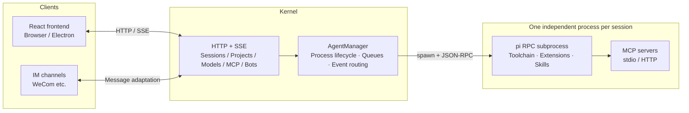

<div align="center">

**English** | [简体中文](./README.zh-CN.md)


# WA PI Agent

**A GUI framework for the pi agent — a powerful AI coding engine deserves an equally capable desktop interface.**

Not a single command to memorize: sessions, models, MCP, skills, and memory — all point-and-click.

Visual session management · Multi-agent collaboration · IM bot channels · MCP ecosystem · Desktop & browser · 中文 / English UI


</div>

---

<div align="center">

<br/><em>Session view: reasoning, tool calls, streaming replies, and token stats at a glance</em>
</div>

## What is this

WA PI Agent is a **graphical desktop framework** for the [pi](https://github.com/earendil-works) agent engine. pi is a powerful AI coding agent engine, but it ships with a CLI only — configuration means hand-editing JSON, juggling multiple sessions is painful, and MCP failures surface as raw stack traces. WA PI Agent wraps it in a complete GUI, turning every engine capability into something you can see and click.

**Every session is an independent pi subprocess** with its own working directory, toolchain, and context — no interference. Engine upgrades (pi updates) and interface upgrades (this framework) are decoupled: when pi ships new capabilities, the framework picks them up automatically.

On top of that, the framework offers **multi-agent collaboration**: instead of one "do-everything chat box", you get an AI team with clear roles — project manager, product manager, frontend/backend developers, test analyst, code reviewer… Each agent has its own prompt, toolset, skills, and memory, and they can delegate tasks to one another like a real team.

## Up and running in three minutes

```bash
git clone <repo-url>
cd wa-pi
bun install
bun run dev
```

The only prerequisite is [Bun](https://bun.sh) ≥ 1.3. Once started, your browser opens `http://localhost:5180` automatically. Add a model provider (OpenAI-compatible or Anthropic protocol) under "Settings → Model Management", pick an agent on the home page, and start chatting.

macOS users can also double-click `start.command` in the repo root; Windows users double-click `start.bat`.

**Prefer a desktop app?** The kernel ships as a sidecar — no runtime to pre-install — with built-in auto-update:

```bash
bun run pack:mac     # macOS
bun run pack:win     # Windows
bun run pack:linux   # Linux
bun run pack:all     # all platforms
```

All data stays in your local `~/.pi/agent` directory. Nothing is uploaded to any server.

## Why a GUI instead of the pi CLI

| pi native (CLI) | WA PI Agent (GUI) |
| --- | --- |
| Hand-written JSON for model providers | Settings form + one-click connection test |
| CLI flags to manage sessions | Sidebar project/session list, click to switch |
| Raw stack traces for MCP errors | Visual connection status + human-readable diagnostics |
| One agent, one session | Multi-agent team with task delegation and concurrency |
| Skills/plugins via directory conventions | Graphical enable/disable, install & management |
| Terminal only | Desktop app + browser + IM bots |

## Key features

### 🖥 A friendly desktop experience

- **One codebase, two ends**: run `bun run dev` in the browser, or package an **Electron desktop app** (macOS / Windows / Linux)
- **Full-featured sessions**: message queueing / steering, interrupt & resume, history branching, attachments, **voice input**, and per-message reasoning effort (off / mid / high / max)
- **No need to stare at the screen**: sound cues when a task finishes or needs your input
- **Bilingual UI (Chinese & English)**, with customizable font size and export preferences

### 🤖 A multi-agent team

- **9 built-in expert roles** (senior project manager, product manager, frontend/backend developers, test analyst, code reviewer, data analyst, UX designer, meeting minutes) — ready out of the box
- **Custom agents**: prompt, tool whitelist, skills, model, and reasoning effort all independently configurable
- **Task delegation**: agents can invoke sub-agents via `delegate` / `fleet` (three built-in types: general-purpose / Explore / Plan) — complex tasks are split, run concurrently, and aggregated automatically

### 💬 IM bot channels

- Put agents on IM: configure **bots** in Settings, bind any agent, and incoming IM messages are handled by it automatically
- **WeCom (Enterprise WeChat) supported**; WeChat, Feishu, and QQ channel types are reserved
- IM conversations are grouped separately in the sidebar, managed alongside local sessions

### 🔌 MCP connectors

- Manage [Model Context Protocol](https://modelcontextprotocol.io) servers graphically: stdio / HTTP transports, global and project-level configuration
- **Connection testing + live tool listing**, with a built-in OAuth authorization flow
- Failures come with **human-readable diagnostics** instead of raw stack traces

<div align="center">

<br/><em>MCP connectors: connection status, tool counts, error diagnostics</em>
</div>

### 🧩 Plugin ecosystem: dynamic install / uninstall / upgrade, hot-reloaded

- **Full lifecycle in the GUI**: type an npm package name (`name@version`, git URLs, and local paths supported) to install; uninstall, enable/disable, and upgrade are all one click
- **Hot reload, no restart**: install, uninstall, and upgrade take effect in the current conversation immediately (sessions mid-reply reload on the next message)
- **New-version detection**: an upgrade badge appears when updates are available; one-click upgrade with streaming install logs
- **TUI plugins work out of the box**: extensions written for pi need no changes — status bars, widgets, dialogs, and notifications render as native GUI components
- Slash commands contributed by plugins can be inspected and toggled individually

<div align="center">

<br/><em>Plugin management: dynamic install / uninstall / upgrade, hot-reloaded</em>
</div>

### 🧠 Models / Skills / Memory

- **Model management**: custom OpenAI-compatible / Anthropic providers, multi-model mounting, connection tests
- **Skill system**: a directory is a skill; pluggable enable/disable
- **Memory system**: global and project-level memory, letting agents accumulate experience across sessions

<div align="center">

</div>

### 🩺 Transparent runtime status

- **Full pi RPC event integration**: real-time progress for auto-retry, context compaction, and summarization retries — no more guessing behind a spinner
- **Extension status visualization**: extension `setStatus` bars and `setWidget` panels rendered natively; extension errors toast immediately and collect in the **Diagnostics** settings tab
- Reasoning, tool calls, and token usage are shown step by step — the agent is no longer a black box

## Architecture

The framework's responsibilities are clear: **the GUI owns experience, pi owns intelligence, the kernel owns orchestration**.



- **Frontend**: React 19 + Vite 8 + Zustand + Tailwind CSS, talking to the kernel over HTTP + SSE
- **Kernel** (`@wa-pi/kernel`): the session orchestration layer — process lifecycle, message queues, event routing, UI request bridging, IM channel adaptation
- **Engine** (pi): each session is a `pi --mode rpc` subprocess; tool execution, extension loading, and MCP connections all happen inside the process

## Project structure

```text
├── packages/
│   ├── kernel/      # Kernel: session orchestration, HTTP/SSE server, pi process management, IM channels
│   ├── frontend/    # React frontend (shared by browser and Electron)
│   ├── desktop/     # Electron shell, auto-update and packaging scripts
│   └── shared/      # Types and constants shared by frontend and backend
├── patches/         # bun patches for upstream deps (pi / pi-mcp-adapter)
└── scripts/         # dev startup orchestration, OSS publishing
```

## Development

```bash
bun run dev            # Run frontend and backend in parallel (press R to reload)
bun test               # All tests (kernel + shared + desktop + frontend)
bun run typecheck      # Type checking
```

- Runtime environment variables: `WA_PI_WS_PORT` (kernel port, default 9776), `WA_PI_WEB_PORT` (frontend port, default 5180), `WA_PI_PREVIEW_PORT` (preview port, default 9777), `WA_PI_DIR` (data directory, default `~/.pi/agent`)
- Frontend E2E tests live in `packages/frontend`: `bun run e2e` (Playwright)
- Customizations to upstream deps (pi, pi-mcp-adapter) are managed as [bun patches](https://bun.sh/docs/install/patch) in `patches/`, applied automatically by `bun install`

## Roadmap

**Already shipped:**

- [x] Multi-agent sessions and delegation (delegate / fleet)
- [x] Graphical MCP management (with OAuth and error diagnostics)
- [x] Skills / plugins / memory systems
- [x] Hot-reloaded plugins: dynamic install / uninstall / upgrade, no restart
- [x] pi RPC event transparency: retry / compaction / summarization progress, extension status & widget visualization
- [x] Electron desktop packaging and auto-update
- [x] IM bot channels (WeCom)
- [x] Bilingual Chinese & English UI

**What's next:**

- [ ] **Visual workflow orchestration** — upgrade multi-agent collaboration from "one conversation" to "reusable workflows": drag-and-drop task nodes, and let your AI team run the process you define, automatically
- [ ] **Scheduled tasks** — let agents run on a schedule: daily code inspections, timed data aggregation, periodic report generation, unattended
- [ ] **Connectors** — a ready-to-use connector marketplace on top of MCP: more IM platforms, more SaaS services, configure and go
- [ ] **Artifact sharing** — one-click export and sharing of conversations, analysis reports, and generated images, so AI output flows to where your team needs it
- [ ] **Diff monitoring** — watch what you care about: automatic detection of changes in files, pages, and data sources, with real-time alerts that can be handed straight to an agent

## Contributing

Issues and PRs are welcome. Before submitting, make sure `bun test` passes and add your entry at the top of `CHANGELOG.md`.

## License

Released under the [MIT License](./LICENSE).
