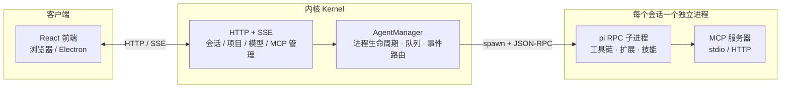

<div align="center">


# WA PI Agent

**把一支 AI 专家团队，装进你的开发工作流。**

多智能体协作 · 独立进程会话 · MCP 生态 · 桌面与浏览器双端


</div>

---

## 这是什么

WA PI Agent 是一个**多智能体（Multi-Agent）协作工作台**。你不再面对一个"万能聊天框"，而是拥有一支角色明确的 AI 团队——项目经理、产品经理、前后端开发、测试分析、代码审查……每个智能体有自己的提示词、工具集、技能与记忆，可以互相委托任务，像真实团队一样分工协作。

底层由 [pi](https://github.com/earendil-works) agent 引擎驱动：**每个会话都是一个独立的 pi 子进程**，拥有自己的工作目录、工具链和上下文，互不干扰。

<div align="center">

<br/><em>会话界面：思考过程、工具调用、流式回复与 Token 统计一目了然</em>
</div>

## 核心特性

### 🤖 多智能体团队

- 内置 **9 个专家角色**（高级项目经理、产品经理、前后端开发、测试、审查等），开箱即用
- 支持**自定义智能体**：提示词、工具白名单、技能、模型、思考强度均可独立配置
- **任务委托**：智能体之间可通过 `delegate` / `fleet` 调起子智能体（内置 general-purpose / Explore / Plan 三种类型），复杂任务自动拆分、并发执行、结果聚合

### 🗂 项目与会话

- 按**项目目录**组织会话，每个会话独立工作目录、独立进程、独立上下文
- 会话支持**消息排队 / 引导（steer）**、中断恢复、历史分支
- 附件上传、**语音输入**、思考强度（off / mid / high / max）逐条调节

### 🔌 MCP 连接器

- 图形化管理 [Model Context Protocol](https://modelcontextprotocol.io) 服务器：stdio / HTTP 两种传输，全局与项目两级配置
- **连接测试 + 工具清单实时查看**，OAuth 授权流程内置支持
- 连接失败给出**可读的错误诊断**（而非原始报错堆栈）

<div align="center">

<br/><em>MCP 连接器：连接状态、工具数量、错误诊断</em>
</div>

### 🧩 模型 / 技能 / 插件 / 记忆

- **模型管理**：自定义 OpenAI 兼容 / Anthropic 协议供应商，多模型挂载、连接测试
- **技能系统**：目录即技能，可插拔启用/禁用
- **插件系统**：npm 包即扩展，图形化安装与管理
- **记忆系统**：全局 / 项目两级记忆，智能体跨会话积累经验

<div align="center">

</div>

### 🖥 桌面 + 浏览器双端

同一套代码，既能 `bun run dev` 在浏览器里用，也能打包成 **Electron 桌面应用**（macOS / Windows / Linux），内核作为 sidecar 随应用分发，无需预装任何运行时。

## 快速开始

**前置要求**：[Bun](https://bun.sh) ≥ 1.3

```bash
git clone <仓库地址>
cd wa-pi
bun install
bun run dev
```

启动后浏览器自动打开 `http://localhost:5180`（内核 API 在 `9776`）。

macOS 用户也可以直接双击根目录的 `start.command`，Windows 用户双击 `start.bat`。

**打包桌面应用**：

```bash
bun run pack:mac     # macOS
bun run pack:win     # Windows
bun run pack:linux   # Linux
```

首次使用：打开「系统设置 → 模型管理」添加一个模型供应商（OpenAI 兼容或 Anthropic 协议），回到首页选择智能体即可开始对话。所有数据保存在本地 `~/.wa-pi` 目录。

## 架构



- **前端**：React 19 + Vite 8 + Zustand + Tailwind CSS，通过 HTTP + SSE 与内核通信
- **内核**（`@wa-pi/kernel`）：会话编排层——进程生命周期、消息队列、事件路由、UI 请求桥接
- **引擎**（pi）：每个会话一个 `pi --mode rpc` 子进程，工具执行、扩展加载、MCP 连接都在进程内完成

## 项目结构

```
├── packages/
│   ├── kernel/      # 内核：会话编排、HTTP/SSE 服务、pi 进程管理
│   ├── frontend/    # React 前端（浏览器与 Electron 共用）
│   ├── desktop/     # Electron 壳与打包脚本
│   └── shared/      # 前后端共享类型与常量
├── patches/         # 对上游依赖的 bun patch（pi / pi-mcp-adapter）
├── scripts/         # dev 启动编排
└── docs/            # 设计文档与 README 素材
```

## 开发

```bash
bun run dev            # 前后端并行开发（改代码按 R 重载）
bun test               # 全部测试（内核 + 共享 + 前端）
bun run typecheck      # 类型检查
```

- 运行时可调环境变量：`WA_PI_WS_PORT`（内核端口，默认 9776）、`WA_PI_WEB_PORT`（前端端口，默认 5180）、`WA_PI_DIR`（数据目录，默认 `~/.wa-pi`）
- 对上游依赖（pi、pi-mcp-adapter）的定制修改通过 `patches/` 目录的 [bun patch](https://bun.sh/docs/install/patch) 管理，`bun install` 自动应用

## 路线图

- [x] 多智能体会话与委托
- [x] MCP 图形化管理（含 OAuth）
- [x] 技能 / 插件 / 记忆系统
- [x] Electron 桌面打包
- [ ] 会话录制与回放
- [ ] 团队协作与共享配置

## 贡献

欢迎 Issue 与 PR。提交前请确保 `bun test` 通过，并在 `CHANGELOG.md` 顶部补充你的变更条目。

## 许可证

本项目暂未指定开源许可证，转载与使用请先联系作者。
