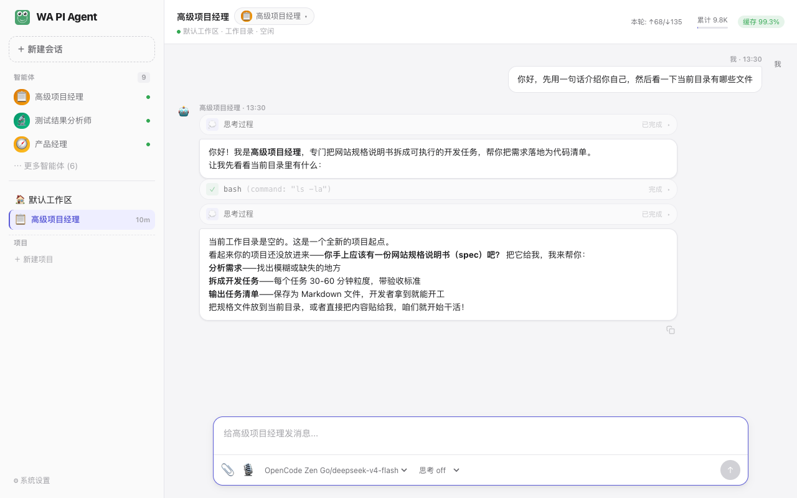
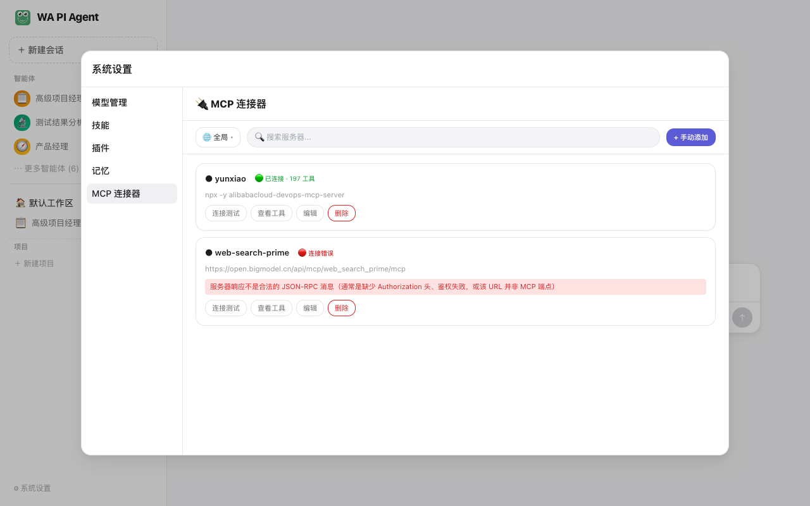
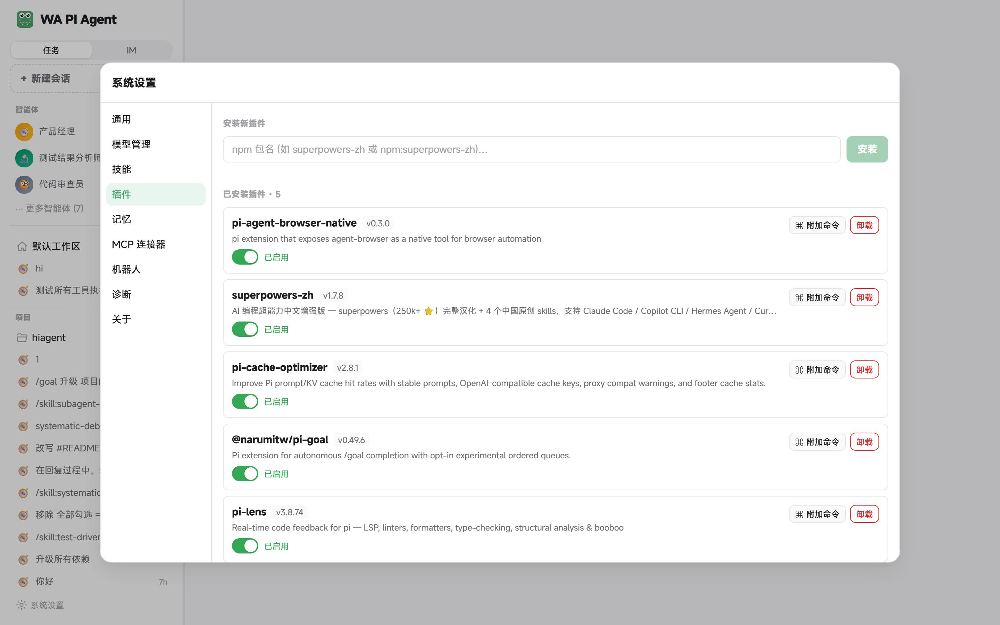
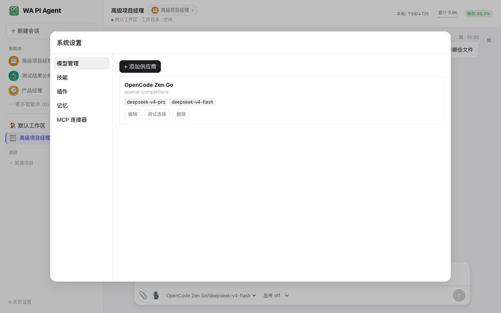
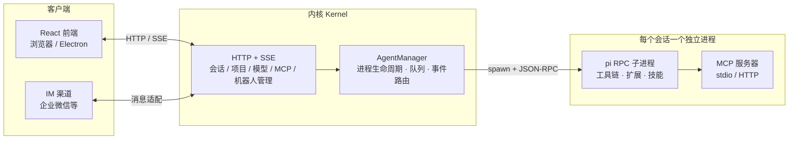

<div align="center">

[English](./README.md) | **简体中文**


# WA PI Agent

**pi agent 的 GUI 框架——强大的 AI 编程引擎，值得一个同样好用的桌面界面。**

一条命令都不用记：会话、模型、MCP、技能、记忆，全部点点鼠标搞定。

图形化会话管理 · 多智能体协作 · IM 机器人渠道 · MCP 生态 · 桌面与浏览器双端 · 中文 / English 双语界面


🌍 [官网](https://www.wapiagent.top/index.html) · [⬇ 下载最新版](https://github.com/luandapipi91/Wa-PiAgent/releases/latest)

</div>

---

<div align="center">

<br/><em>会话界面：思考过程、工具调用、流式回复与 Token 统计一目了然</em>
</div>

## 这是什么

WA PI Agent 是 [pi](https://github.com/earendil-works) agent 引擎的**图形化桌面框架**。pi 是一个强大的 AI 编程智能体引擎，但原生只有命令行界面——配置靠手改 JSON、多会话难管理、MCP 报错只有一堆堆栈。WA PI Agent 为它套上一层完整的 GUI，把引擎的每一项能力都变成看得见、点得着的界面操作。

**每个会话都是一个独立的 pi 子进程**，拥有自己的工作目录、工具链和上下文，互不干扰。引擎升级（pi 更新）与界面升级（本框架更新）彼此解耦——pi 出新能力，框架自动承接。

在此之上，框架还提供**多智能体（Multi-Agent）协作**：你不再面对一个「万能聊天框」，而是拥有一支角色明确的 AI 团队——项目经理、产品经理、前后端开发、测试分析、代码审查……每个智能体有自己的提示词、工具集、技能与记忆，可以互相委托任务，像真实团队一样分工协作。

## 三分钟上手

```bash
git clone <仓库地址>
cd wa-pi
bun install
bun run dev
```

唯一的前置要求是 [Bun](https://bun.sh) ≥ 1.4。启动后浏览器自动打开 `http://localhost:5180`，在「系统设置 → 模型管理」添加一个模型供应商（OpenAI 兼容或 Anthropic 协议），回到首页选一个智能体，开始对话。

macOS 用户也可以直接双击根目录的 `start.command`，Windows 用户双击 `start.bat`。

**不想要浏览器？打包成桌面应用**，内核作为 sidecar 随应用分发，无需预装任何运行时，还内置自动更新：

```bash
bun run pack:mac     # macOS
bun run pack:win     # Windows
bun run pack:linux   # Linux
bun run pack:all     # 全平台
```

所有数据保存在本地 `~/.pi/agent` 目录，不上传任何服务器。

## 为什么用 GUI，而不是直接用 pi CLI

| pi 原生（CLI） | WA PI Agent（GUI） |
| --- | --- |
| 手写 JSON 配置模型供应商 | 设置页表单填写 + 一键连接测试 |
| 命令行参数管理会话 | 侧边栏项目/会话列表，点击切换 |
| MCP 报错只看原始堆栈 | 连接状态可视化 + 可读的错误诊断 |
| 单智能体单会话 | 多智能体团队，支持任务委托与并发 |
| 技能/插件靠目录约定 | 图形化启用/禁用、安装与管理 |
| 只在终端里用 | 桌面应用 + 浏览器 + IM 机器人多渠道触达 |

## 核心特性

### 🖥 友好的桌面操作体验

- **双端同源**：一套代码，既能 `bun run dev` 在浏览器里用，也能打包成 **Electron 桌面应用**（macOS / Windows / Linux）
- **会话全功能**：消息排队 / 引导（steer）、中断恢复、历史分支、附件上传、**语音输入**，思考强度（off / mid / high / max）逐条调节
- **不盯屏也放心**：任务完成与需要操作时播放提示音，还有一只青蛙从聊天区角落蹦出道贺（外观设置中可关闭）
- **中英双语界面**，字号、导出偏好等均可自定义

### 🎨 所见即所得的页面预览与编辑

- **实时预览**：AI 生成的页面在预览面板即时呈现，本地 HTML 与外部 URL 双模式
- **精准选中**：悬停任意元素高亮，点选或选父级，一键「发送到聊天」——AI 拿到的是精确到源码行号的定位，而非截图
- **嵌套 iframe 也能选中**：内层页面元素同样定位到真实磁盘文件，改的永远是对的地方
- 设计师协作利器：指哪改哪，无需截图来回描述

### 🤖 多智能体团队

- 内置 **9 个专家角色**（高级项目经理、产品经理、前后端开发、测试、审查、数据分析、UX 设计、会议纪要），开箱即用
- 支持**自定义智能体**：提示词、工具白名单、技能、模型、思考强度均可独立配置
- **@ 随时指派**：聊天框敲 `@` 唤起智能体面板，指定角色上场；配合「关系网」让智能体主动/被动协作
- **任务委托**：智能体之间可通过 `delegate` / `fleet` 调起子智能体（内置 general-purpose / Explore / Plan 三种类型），复杂任务自动拆分、并发执行、结果聚合

### 💬 IM 机器人渠道

- 把智能体接到 IM 上：在设置页配置**机器人**，绑定任意智能体，来自 IM 的消息自动由它处理
- 已支持**企业微信**，微信、飞书、QQ 渠道类型已预留
- IM 对话在侧边栏独立分组展示，与本地会话统一管理

### ⏰ 自动化定时任务

- **定时驱动**：让智能体按 cron 计划自动执行——每日巡检、定时汇总、周期报告，无人值守
- **执行状态一目了然**：成功 / 失败 / 运行中状态点 + 上次执行时间，右键可立即执行
- **结果推送到 IM**：任务完成后自动通过 IM 机器人把结果推送进你的企业微信群

### 🔌 MCP 连接器

- 图形化管理 [Model Context Protocol](https://modelcontextprotocol.io) 服务器：stdio / HTTP 两种传输，全局与项目两级配置
- **连接测试 + 工具清单实时查看**，OAuth 授权流程内置支持
- 连接失败给出**可读的错误诊断**（而非原始报错堆栈）

<div align="center">

<br/><em>MCP 连接器：连接状态、工具数量、错误诊断</em>
</div>

### 🧩 插件生态：动态安装 / 卸载 / 升级，热加载即时生效

- **图形化全生命周期管理**：输入 npm 包名（支持 `name@version`、git URL、本地路径）一键安装，卸载、启用/禁用、版本升级全部点按钮完成
- **热加载，无需重启**：安装、卸载、升级在当前对话立即生效（正在生成回复的会话会在下次发送消息时自动重载）
- **新版本检测**：已安装插件出现新版本时显示升级徽章，一键升级，安装/升级日志流式可见
- **TUI 插件开箱即用**：为 pi 编写的扩展无需修改——状态栏、Widget、对话框、通知等 UI 原语自动以 GUI 原生组件呈现
- 插件贡献的 slash 命令可逐项查看与开关

<div align="center">

<br/><em>插件管理：动态安装 / 卸载 / 升级，热加载即时生效</em>
</div>

### 🧠 模型 / 技能 / 记忆

- **模型管理**：自定义 OpenAI 兼容 / Anthropic 协议供应商，多模型挂载、连接测试
- **技能系统**：目录即技能，可插拔启用/禁用
- **记忆系统**：全局 / 项目两级记忆，智能体跨会话积累经验

<div align="center">

</div>

### 🩺 运行状态透明化

- **pi RPC 事件全面对接**：自动重试、上下文压缩、摘要重试的进度实时提示，不再对着转圈猜测智能体在干什么
- **扩展状态可视化**：扩展的 setStatus 状态栏与 setWidget 面板原生呈现，扩展错误即时提醒并沉淀到设置页的**诊断**面板
- 思考过程、工具调用、Token 消耗在会话中逐条呈现，智能体不再黑盒

## 架构

框架的职责很清晰：**GUI 负责体验，pi 负责智能，内核负责编排**。



- **前端**：React 19 + Vite 8 + Zustand + Tailwind CSS，通过 HTTP + SSE 与内核通信
- **内核**（`@wa-pi/kernel`）：会话编排层——进程生命周期、消息队列、事件路由、UI 请求桥接、IM 渠道适配
- **引擎**（pi）：每个会话一个 `pi --mode rpc` 子进程，工具执行、扩展加载、MCP 连接都在进程内完成

## 项目结构

```text
├── packages/
│   ├── kernel/      # 内核：会话编排、HTTP/SSE 服务、pi 进程管理、IM 渠道
│   ├── frontend/    # React 前端（浏览器与 Electron 共用）
│   ├── desktop/     # Electron 壳、自动更新与打包脚本
│   └── shared/      # 前后端共享类型与常量
├── patches/         # 对上游依赖的 bun patch（pi / pi-mcp-adapter）
└── scripts/         # dev 启动编排、OSS 发布
```

## 开发

```bash
bun run dev            # 前后端并行开发（改代码按 R 重载）
bun test               # 全部测试（内核 + 共享 + 桌面 + 前端）
bun run typecheck      # 类型检查
```

- 运行时可调环境变量：`WA_PI_WS_PORT`（内核端口，默认 9776）、`WA_PI_WEB_PORT`（前端端口，默认 5180）、`WA_PI_PREVIEW_PORT`（预览端口，默认 9777）、`WA_PI_DIR`（数据目录，默认 `~/.pi/agent`）
- 前端 E2E 测试在 `packages/frontend` 内：`bun run e2e`（Playwright）
- 对上游依赖（pi、pi-mcp-adapter）的定制修改通过 `patches/` 目录的 [bun patch](https://bun.sh/docs/install/patch) 管理，`bun install` 自动应用

## 路线图

**已经交付：**

- [x] 多智能体会话与委托（delegate / fleet）
- [x] MCP 图形化管理（含 OAuth 与错误诊断）
- [x] 技能 / 插件 / 记忆系统
- [x] 插件热加载：动态安装 / 卸载 / 升级，无需重启
- [x] pi RPC 事件透明化：重试 / 压缩 / 摘要进度、扩展状态与 Widget 可视化
- [x] Electron 桌面打包与自动更新
- [x] IM 机器人渠道（企业微信）
- [x] 自动化定时任务（cron 驱动 + IM 推送结果）
- [x] 中英文双语界面

**接下来的方向：**

- [ ] **可视化流程编排**——把多智能体协作从「一次对话」升级为「可复用的工作流」：拖拽编排任务节点，让 AI 团队按你定义的流程自动运转
- [ ] **连接器**——在 MCP 之上提供开箱即用的连接器市场：更多 IM 平台、更多 SaaS 服务，配置即用，不再从零搭集成
- [ ] **产物分享**——会话记录、分析报告、生成图片等产物一键导出与分享，让 AI 的产出流动到团队需要的地方
- [ ] **差异监控**——盯住你在意的东西：文件、页面、数据源的变化自动检测，差异实时告警并可直接转交智能体处理

## 贡献

欢迎 Issue 与 PR。提交前请确保 `bun test` 通过，并在 `CHANGELOG.md` 顶部补充你的变更条目。

## 许可证

本项目基于 [MIT 许可证](./LICENSE) 开源。
