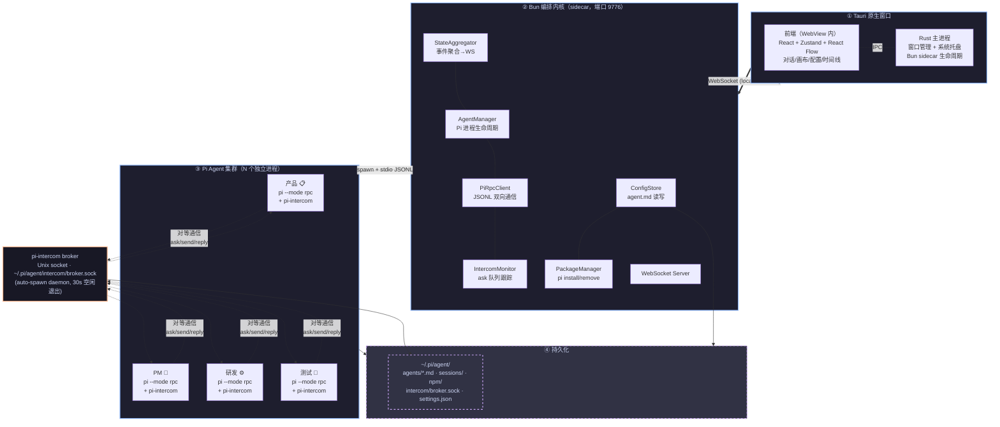
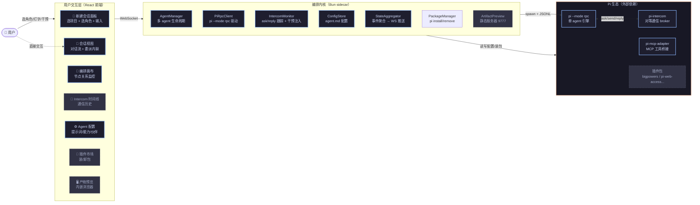

# HiAgent 设计文档

> 基于 Pi Coding Agent 的本地多 agent 编排管理系统
>
> 日期：2026-07-05
> 状态：设计中（最高风险项已验证 + UI 规格沉淀自原型，见 2026-07-06 更新）
> 2026-07-06 更新：原 MVP 按 agentName 单维度组织（单项目），现扩展为多项目。
> sidebar 与会话归属已重构为「项目 → 会话」两级模型，详见
> `docs/superpowers/specs/2026-07-06-sidebar-projects-design.md`。
> 本文档中凡涉及单项目/启动页/sidebar 三区的旧描述均以该文档为准。

## 一、项目概述

### 1.1 目标

构建一个本地桌面客户端，让用户以**对等角色协作**的方式运行多个 AI agent。核心场景：产品、PM、研发、测试四个 agent 在同一项目里动态相互委派任务 —— 产品做需求时遇到技术问题 ask 研发，研发调研回复后产品继续；产品完成需求后委派给 PM 安排实现。

### 1.2 核心特征

- **本地客户端运行**：Tauri 原生窗口，双击启动，无需服务器部署
- **底层 Bun**：编排内核是 Bun sidecar 进程；Pi 本身就是 Bun 二进制，全栈单运行时
- **基于 Pi Coding Agent**：每个 agent 是一个独立 Pi 进程，通过 `pi --mode rpc` 协议控制
- **动态双向委派**：agent 间用 pi-intercom 的 ask/send/reply 对等通信，不是预定义 DAG

### 1.3 用户价值

Pi 生态已有成熟编排后端（pi-subagents / pi-dynamic-workflows / pi-task / pi-crew）和通信（pi-intercom），但缺少：
1. 统一的 GUI 来管理多个 agent 会话
2. 可视化的协作关系与实时状态
3. 细粒度的资源（工具/技能）分配 —— Pi 的 `pi` 字段是全有或全无

HiAgent 填补这个空白：**做一个编排管理层 + GUI，复用已存在的编排后端，不重造引擎**。

### 1.4 非目标

明确不做的事，避免范围蔓延：

- **不做新编排引擎**：不自研 DAG 调度器、不自研 workflow 执行器。编排后端复用 pi-intercom（动态委派）和可选的 pi-subagents（子任务隔离）。
- **不做云服务**：纯本地，不涉及账号、同步、远程访问。手机远程监控（pi-task 的 Web Push）不在 MVP 范围。
- **不做 IDE 集成**：不是 VSCode 插件，不替代编辑器。是独立的桌面应用。
- **不做模型服务**：不内置模型代理，直接用 Pi 的 ModelRegistry 接入用户的 API key。

## 二、技术调研结论

详细调研记录（Pi SDK / 扩展体系 / pi-intercom / pi-subagents / pi-dynamic-workflows / pi-task / pi-crew / pi-mcp-adapter / pi-package-webui / glimpseui / gentle-pi / bigpowers / Bun 桌面框架）在本次会话的子 agent 报告中，待整理到 `docs/research/`。关键结论：

| 维度 | 结论 |
|------|------|
| Pi SDK | `createAgentSession` 可编程嵌入，但 GUI 控制用 `pi --mode rpc` JSONL 更合适 |
| Pi 运行时 | Pi 原生发行包内含 Bun 二进制，全栈 Bun 是自然组合 |
| 编排后端 | pi-intercom（对等通信，ask 阻塞语义）匹配动态委派场景 |
| MCP 桥接 | pi-mcp-adapter 已把 MCP 工具转成 Pi 工具，无需自研 |
| 桌面框架 | Tauri + Bun sidecar 最优；pi-package-webui 已验证 `pi --mode rpc` 驱动 GUI |

## 三、系统架构

### 3.1 分层架构



**四层说明**：
- **① Tauri**：只管窗口壳 + 启停 Bun sidecar，无业务逻辑。前端在 WebView 内跑。
- **② Bun 编排内核**：唯一与 Pi 进程交互的地方。前端不直接 spawn pi。
- **③ Pi Agent 集群**：每个 agent 一个独立 `pi --mode rpc` 进程，进程级隔离，单 agent 崩溃不影响其他。
- **④ 持久化**：文件系统作真相源，Bun 内核重启可恢复。

**三种通信通道**：
- 前端 ↔ 内核：**WebSocket**（localhost:9776，JSONL 消息）
- 内核 ↔ Pi：**stdio JSONL**（每个 PiRpcClient 持有一个子进程的 stdin/stdout）
- Pi ↔ Pi：**pi-intercom broker**（Unix socket，对等 ask/send/reply，内核通过 IntercomMonitor 旁路监听）

### 3.2 关键技术决策

#### 决策 1：Bun sidecar 而非 Tauri 内嵌

编排内核作为独立 Bun 进程运行，Tauri 只负责窗口壳子 + 启停 Bun。

**理由**：
- 避免 Rust ↔ Bun 的 IPC 复杂性
- Bun 进程崩溃不影响窗口；用户不丢失正在查看的状态
- Bun 原生 WebSocket（`Bun.serve({ websocket })`）比 Node SSE 更简洁

#### 决策 2：pi --mode rpc 而非 SDK 内嵌

每个 agent 是独立 `pi --mode rpc` 子进程，宿主通过 stdio 的 JSONL 双向通信。

**理由**：
- 进程级隔离：单个 agent 崩溃不影响其他
- 与 Pi 官方多 agent 模式（pi-subagents）一致
- pi-package-webui 已验证此协议完整可控（prompt/abort/model/bash/compact/session 等 RPC 命令）

**RPC 命令清单**（客户端 API surface 基线）：
```
prompt / steer / follow_up / abort / bash / new_session /
set_model / set_thinking_level / compact / cycle_model /
get_state / get_messages / get_available_models / get_session_stats
```

#### 决策 3：pi-intercom 作编排总线

4 个 agent 对等通信，用 pi-intercom 的三个原语：
- **`ask`**：阻塞委派（"产品问研发，等调研回来"）—— 发送并 await 回复
- **`send`**：异步通知（"PM 委派研发"）—— fire-and-forget
- **`reply`**：回复（自动指向最近的 ask）

**理由**：动态双向委派需要的是对等运行时通信，不是预定义 DAG。pi-intercom 的 `ask` 阻塞语义精确匹配场景。✅ **已验证（2026-07-06）**：ask/send/reply 三原语在 `pi --mode rpc` 无头模式下端到端跑通，broker 路由 + reply 配对 ask 解除等待全部正常。

## 四、核心机制设计

### 4.1 ask 不设超时

**用户决策**：产品可以无限等研发。这是特性，不是 bug。

**技术真相**：
- ask 是一次 tool call，等待期间 LLM 不调用，**消耗 0 token / 0 费用**
- 只是 tool 在 await，上下文冻结在内存
- ✅ **已验证（2026-07-06，pi-intercom v0.6.0）**：broker **没有 ask 超时 GC 机制**，ask 阻塞完全在客户端（发送方注册 message 事件监听等 reply），**天然支持无限等待，无需"包装设为 Infinity"**。客户端 send 的 10 秒超时是 broker 握手超时，不影响 ask 阻塞。（注：GitHub main 分支源码含 `getAskTimeoutMs` 默认 10 分钟的 ask edge GC，未来升级到该版本后需通过 config 覆盖；当前 v0.6.0 无此问题。详见 `docs/research/pi-intercom-rpc-compatibility.md`）

**结束 ask 的合法路径**：
1. 研发通过 intercom reply 回复（正常流程）
2. 用户手动替答（编排内核合成一个 reply）
3. 用户手动取消这次 ask
4. 产品或研发进程被关闭

### 4.2 FIFO 串行队列

**用户决策**：研发被多人 ask 时，按到达顺序处理，一次一个。maxConcurrency=1。

**实现**：
- IntercomMonitor 跟踪每个 agent 的 pending ask 队列
- 画布/sidebar 显示队列状态（`#1 产品(处理中)` `#2 PM(已等 1m12s)`）
- 不暴露 maxConcurrency 配置项（固定 =1）

### 4.3 用户可介入（可选）

无超时意味着用户必须有手段结束/加速，但这是**可选干预**，永远挂在那等也是合法状态。

阻塞中的 ask 显示三个按钮：
- **🙋 我来回答**：用户直接替被问 agent 输入 → 编排内核转成 intercom reply
- **⚡ 催一下**：弹输入框 → 用户打字 → 作为高优先级 steer 插给被问 agent（不打断当前 turn，下一个 turn 优先看）
- **✕ 取消**：取消这次 ask，让发起方继续

## 五、数据模型

### 5.1 Agent 定义（Markdown + frontmatter）

每个 agent = 一个 `.md` 文件，存于 `~/.pi/agent/agents/<name>.md`：

```yaml
---
name: dev
displayName: 研发
avatar: ⚙️                          # emoji 或图片路径
avatarColor: "#fab387-#f38ba8"      # 渐变色
description: 后端研发，负责技术调研、架构设计、代码实现
model: anthropic/claude-sonnet-4
thinking: high
systemPromptMode: replace           # replace | append
inheritProjectContext: true
inheritSkills: false
tools: read, bash, edit, write, grep, find, ls, web_search, fetch_url
skills: architecture-review, debug-methodically, write-tests-first
# HiAgent 扩展字段
mcpServers: []                      # 启用的 MCP server 名单
partners:                           # 委派关系（= 画布连线）
  askTo: [product, test]
  askFrom: [product, pm, test]
---
你是一名资深后端工程师，专注于技术调研和高质量代码实现...
```

**字段说明**：
- 标准 Pi 字段（name/description/model/thinking/tools/skills 等）由 Pi 原生处理
- HiAgent 扩展字段（displayName/avatar/mcpServers/partners）由编排内核解析

### 5.2 资源三层模型（agent 级分配）

**关键差异**：Pi 原生的资源过滤是"包级"的（settings.json 里控制某包加载哪些资源，加载后对所有 agent 共享）。HiAgent 把分配粒度下沉到"agent 级" —— 每个 agent 独立配置自己的工具/技能/MCP。技术细节见 `docs/research/pi-packages-install-and-agent-allocation.md`。

```
插件市场（资源池）
├── 🔒 内置核心（不可删除）
│   ├── pi-intercom             ← 通信桥（不显示在能力 tab）
│   ├── pi-mcp-adapter          ← MCP 桥接器（不显示在能力 tab）
│   └── pi-agent-browser-native ← agent 操控浏览器（显示在能力 tab，agent 级启用）
└── 📦 已安装（可删除）
    ├── pi-web-access      ← 提供工具：web_search, fetch_url, pdf_extract
    ├── bigpowers          ← 提供 73 个技能
    └── superpowers-zh     ← 提供 12 个技能

        ↓ 装了之后，去 Agent 配置分配

Agent 配置（分配入口）— 每个 agent 独立
└── 能力 tab（汇总卡 5 格：内置/插件/MCP/浏览器/技能）
    ├── 📁 内置工具       (read/bash/edit...)     ← 可勾选
    ├── 🌐 插件工具       (web_search/fetch_url)  ← 可勾选（产品✓ 研发✓ PM✗ 测试✗）
    ├── 🔌 MCP 工具       (chrome-devtools/figma) ← 可勾选（按 MCP server 分组）
    └── 🤖 浏览器自动化   (agent_browser)         ← 可勾选（研发✓ 测试✓ 产品✗ PM✗）
```

**为什么可行**：Pi 的 `--tools` flag 是 allowlist 语义。包加载的资源进入"进程可见集"，`--tools` 进一步过滤成"agent 实际能调用的"。HiAgent 不改 Pi 加载逻辑，只在 spawn 时按 agent 配置合成 `--tools` / `--skill` 参数。

### 5.3 核心基础设施（不可删除）

以下三个包预装且锁定，在插件市场显示为 🔒 内置核心，不显示删除按钮：

| 包 | 作用 | 能力 tab 中的显示 |
|----|------|------------------|
| `pi-intercom` | agent 间通信（ask/send/reply） | **不显示**（始终启用，用户改不了） |
| `pi-mcp-adapter` | MCP 工具桥接 | **不显示**（始终激活，MCP 工具来源可用） |
| `pi-agent-browser-native` | agent 操控浏览器（open/snapshot/click/screenshot/qa） | **显示为"🤖 浏览器自动化"分组**，agent 级启用/禁用 |

pi-intercom 和 pi-mcp-adapter 是后台桥接器，提供的能力始终启用，用户改不了也不需要看到。

pi-agent-browser-native 不同：它**显示在"能力" tab 里，agent 级启用/禁用**（研发/测试启用，产品/PM 可关闭）。理由：不是所有 agent 都需要操控浏览器，但包本身不可删（保证需要时立即可用）。

**⚠️ 依赖说明**：pi-agent-browser-native 依赖上游 [agent-browser](https://github.com/vercel-labs/agent-browser) CLI（vercel-labs 项目，独立于 Pi 生态）。HiAgent **在首次启动时自动安装**这个依赖：

- 检测 `agent-browser` 是否在 PATH
- 没有则自动安装（按上游官方推荐方式：`npm install -g agent-browser` 或对应平台的安装脚本）
- 安装过程在启动页显示进度（与 Bun sidecar 启动并行，不阻塞 UI）
- 安装失败时降级：agent_browser 工具显示为"未就绪，点此重试"，但不影响其他能力，应用可正常使用

自动安装的理由：pi-agent-browser-native 是内置核心能力，其依赖理应由 HiAgent 负责就绪，不应把安装负担转嫁给用户。

**与产物预览（8.4）的区别**：
- pi-agent-browser-native = **agent → 浏览器**（agent 自己访问页面，输出截图/快照给 LLM 看）
- 产物预览 = **产物 → 用户**（agent 生成的 HTML，用户在内嵌浏览器看渲染结果）
- 方向相反，互补共存。

### 5.4 项目与会话实体（多项目扩展，2026-07-06）

> 原 MVP 按 agentName 单维度组织会话（单项目）。现扩展为「项目 → 会话」两级模型，让用户能建多个项目（各自独立 cwd + 独立会话历史），agent 配置全局共享。完整规格见 `2026-07-06-sidebar-projects-design.md`。

#### 三层实体

```
Agent（全局，存 ~/.pi/agent/agents/*.md，配置全局共享不按项目隔离）
  ├─ 研发 ⚙️
  ├─ 产品 📋
  ├─ PM 📅
  └─ 测试 🧪

Project（用户级，存 ~/.hiagent/projects.json）
  ├─ id, name, cwd, createdAt

Session（项目内，元数据在 projects.json，内容在 ~/.hiagent/sessions/<id>.json）
  ├─ id, projectId, primaryAgent, title, createdAt, lastActivity
  ├─ messages: ChatMessage[]         ← 主线消息流
  └─ intercomEvents: AskItem[]       ← 主理 agent 发起或被 ask 时的委派事件
```

**会话与 agent 关系**：一个会话 = 一个主理 agent；会话内可见该 agent 发起或收到的所有 intercom 委派（多 agent 协作内联可见，被问 agent 不需要独立会话存在）。

#### 类型定义

```typescript
// packages/shared/src/types.ts 新增

interface ProjectEntity {
  id: string;
  name: string;
  cwd: string;
  createdAt: number;
}

interface SessionEntity {
  id: string;
  projectId: string;
  primaryAgent: string;    // 主理 agent name（"dev" / "product" / ...）
  title: string;           // 首条消息截断，或用户命名
  createdAt: number;
  lastActivity: number;
}

// ChatMessage 不变（id/role/text/timestamp）
// AskItem 加 sessionId 字段
interface AskItem {
  messageId: string;
  sessionId: string;       // ← 新增：归属哪个会话
  from: string;
  to: string;
  text: string;
  startedAt: number;
  resolved?: boolean;
}
```

#### 持久化布局

```
~/.hiagent/
  ├─ projects.json              ← 项目元数据列表（含每个项目的 sessions 元数据）
  └─ sessions/
      ├─ <sessionId>.json       ← 单个会话的 messages + intercomEvents
      └─ ...
```

- `projects.json` 结构：`{ projects: ProjectEntity[], sessions: SessionEntity[] }`（sessions 平铺但带 projectId，便于查询）
- 每个会话内容独立文件，避免单文件膨胀
- Agent 配置仍走 `~/.pi/agent/agents/*.md`（不动）

#### AgentState 维度变化

state 改为按 `(projectId, agentName)` 维度组织（同一研发 agent 在项目 A 和项目 B 是两个独立 pi 进程，状态独立）：

```typescript
// 旧
states: Record<string /* agentName */, AgentState>

// 新
states: Record<string /* `${projectId}:${agentName}` */, AgentState>
```

**Sidebar 状态点按全局聚合**：只要这个 agent 在任意项目里 thinking/blocked，状态点就反映该状态（用户关心"角色忙不忙"而非"在哪个项目忙"）。优先级：blocked > thinking > idle。

## 六、UI 设计

> 以下规格沉淀自 `docs/superpowers/mockups/` 的 13 张原型 HTML，所有 hex 值与文案均与原型对齐。

### 6.0 设计系统

#### 配色（Catppuccin Mocha，深色主题）

| 用途 | hex | 说明 |
|------|-----|------|
| 主背景（Base） | `#1e1e2e` | 画布、对话区背景 |
| 次背景（Mantle） | `#181825` | sidebar、titlebar、输入区背景 |
| 表面（Surface） | `#313244` | 输入框、卡片、工具栏背景 |
| 表面高亮（Surface2） | `#585b70` | 边框、分隔线、禁用态 |
| 文字主（Text） | `#cdd6f4` | 正文、标题 |
| 文字次（Subtext） | `#a6adc8` | 次要正文 |
| 弱化（Overlay） | `#6c7086` | 标签、副文案、占位符 |
| 蓝（Blue） | `#89b4fa` | 主强调（产品色）、当前选中、thinking 态、primary 按钮 |
| 绿（Green） | `#a6e3a1` | 成功、reply、内置工具、在线徽标 |
| 橙（Peach） | `#fab387` | ask/委派、研发色、阻塞等待、警告 |
| 黄（Yellow） | `#f9e2af` | PM 色、能力汇总 |
| 紫（Mauve） | `#cba6f7` | MCP 工具分组色 |
| 红（Red） | `#f38ba8` | 错误、删除、取消、研发渐变副色 |
| Lavender | `#b4befe` | 产品渐变副色 |
| Maroon | `#ebbc9e` | PM 渐变副色 |
| Teal | `#94e2d5` | 测试渐变副色 |

#### 四角色设定（头像渐变 + emoji + 职责文案）

| 角色 | name | emoji | 渐变色 | 副文案（启动页） |
|------|------|-------|--------|-----------------|
| 产品 | product | 📋 | `#89b4fa → #b4befe` | 需求设计 |
| PM | pm | 📅 | `#f9e2af → #ebbc9e` | 项目管理 |
| 研发 | dev | ⚙️ | `#fab387 → #f38ba8` | 技术实现 |
| 测试 | test | 🧪 | `#a6e3a1 → #94e2d5` | 质量验收 |

头像规格：圆形，渐变背景，emoji 居中。启动页 44px、会话 header 28px、sidebar 22px、配置弹窗 52px（带 2px `#cdd6f4` 描边 + 右下角相机角标 `#89b4fa`）。

#### 排印与间距

| 项 | 值 |
|----|----|
| 字体 | `'Segoe UI', sans-serif`（macOS 下回退系统字体） |
| 等宽 | `'Consolas', monospace`（系统提示词预览） |
| 标题 | 28px/700（启动页大标题）、15px/600（配置 header）、13px/600（分区） |
| 正文 | 12px/1.6（对话气泡）、11px（sidebar/列表）、10px（元信息） |
| 小字 | 9px（状态徽标、tab 计数、时间戳） |
| 通用圆角 | 卡片 8px、气泡 12px（带单角 4px 体现方向）、按钮 4-6px、徽标 pill |
| 通用间距 | padding 10-16px、gap 6-12px、消息间距 14px |

#### 状态语义（贯穿所有视图）

| 状态 | 颜色 | 视觉表现 |
|------|------|---------|
| thinking | 蓝 `#89b4fa` | 节点边框 2px + `box-shadow:0 0 20px rgba(137,180,250,0.3)` |
| blocked（等 reply） | 橙 `#fab387` | 节点边框 2px + pulse 动画（1.5s）+ `box-shadow` 呼吸 |
| idle | 灰 `#6c7086` | 节点边框 2px，无发光 |
| 当前选中（sidebar） | 蓝 `#89b4fa` | `border-left:2px solid` + 背景 `rgba(137,180,250,0.15)` |

### 6.1 主交互范式：对话优先

**不是画布优先**。日常使用是对话视图，画布是辅助视图（见原型 `09-conversation-flow.html`）。

**流程**：
1. **主区三态**（不再用独立启动页路由，由 `currentView` 决定）：
   - **empty**（首次启动无项目）：引导建项目
   - **new-session（新建会话面板）**：原"启动页"职责改为主区的一种态，输入框上方是 `📁 项目目录 ▾` + `🤖 agent ▾` **两个下拉并排**（不是大卡片横排）。项目下拉可选已有项目或"新建项目..."；agent 下拉是 4 个全局角色。两条触发入口：顶部"新建会话"全局按钮（项目默认选最近）/ 项目行右侧 ＋（预选该项目）
   - **session（会话视图）**：发送成功或切会话后进入
2. **会话中（Codex 式左右结构，grid 260px 1fr）**：
   - **左 sidebar**（`#181825` 背景，重组为**四区**）：
     - **① 新建会话**：顶部全局按钮，点击主区切到新建会话面板
     - **② 我的智能体**：全局 agent 配置入口，4 个 agent 行（22px 头像+名称+状态点）。点击进 AgentConfig 弹窗（不切会话）。状态点按**全局聚合**（跨项目）：blocked > thinking > idle
     - **③ 项目管理**（分隔线下）：项目可折叠列表，每行 `▶/▼ 项目名  ＋ ⚙️`（折叠/展开 + 项目内新建 + 项目设置）。展开后显示该项目下会话子列表：`{主理agent emoji} {会话标题} · {相对时间}`，选中态 `border-left:2px solid #89b4fa` + `rgba(137,180,250,0.15)` 背景
     - **（无底部 intercom 状态条）**：已按方案 C 移到会话视图 header
   - **右对话区**：
     - header（`#181825`）：28px 头像 + 会话标题 + **橙色 intercom 徽标**（只反映当前会话的活跃 ask：`● {from}→{to} · ask · {计时}`，无活跃则不显示）+ `主理agent · 模型 · 状态` 副文案 + 右侧"编排画布 / ⋯"按钮
     - 消息流（flex column，gap 14px）：每条消息 28px 头像 + 气泡（用户 `#313244` 圆角 `4 12 12 12`；assistant `#181825` 圆角 `12 4 12 12`）+ 时间戳/token 数
     - **委派内联卡片**：见 6.5（同一会话内联可见所有 intercom 委派，被问 agent 不需要独立会话存在）
     - 输入区（`#181825`）：`#313244` 框 + 角色 emoji + placeholder `给产品发消息...` + 蓝色 ↩ 按钮
3. **编排画布（可选视图）**：对话区 header 右上角"编排画布"按钮切换

> 多项目/sidebar 四区/新建会话面板的完整规格见 `docs/superpowers/specs/2026-07-06-sidebar-projects-design.md`，本节仅作主界面概述。

### 6.2 视图清单

| 视图 | 触发方式 | 用途 | 原型 |
|------|---------|------|------|
| 新建会话面板 | 顶部"新建会话"按钮 / 项目行 ＋ | 选项目 + 选 agent + 开始（主区三态之一） | `09-conversation-flow.html` 屏①（改造：下拉并排替代卡片横排） |
| 会话视图（左右） | 发送第一条消息 | 日常对话主界面 | `09-conversation-flow.html` 屏② |
| 编排画布 | 对话区右上角按钮 | 全局协作关系可视化 | `02-main-ui.html` |
| Intercom 时间线 | ~~底部状态条"查看全部"~~ | ⚠️ 此视图在多项目重构后不纳入设计——intercom 信息经会话 header 徽标（点击滚动到委派卡片）+ 内联委派卡片呈现，见 sidebar-projects-design 5.1 | `08-intercom-timeline.html` |
| Agent 配置 | 画布节点"编辑" / sidebar 双击 | 提示词/能力/技能/合作伙伴 | `04b-agent-config-v2.html` |
| 能力 Tab（配置内） | Agent 配置切到"能力" | 三类工具勾选分配 | `07b-capabilities-tab-v2.html` |
| 插件市场 | 顶栏"插件"按钮 | 装/卸包（MVP 外） | `05-package-market.html` |
| 产物预览 | 对话流产物卡片"预览" | 内嵌浏览器看渲染结果（MVP 外） | `10-artifact-preview.html` |

### 6.3 编排画布（辅助视图，原型 `02-main-ui.html`）

画布是"约束+监控"，不是"程序执行"。布局：titlebar（`● 4 agents 在线` 绿徽标 + ⚙）→ 画布 toolbar（"编排画布"标题 + "拖拽添加 agent · 连线表示可通信"提示 + `＋ agent / ▶ 运行 / ⏸` 按钮）→ 画布区（点阵背景 `radial-gradient #313244 1px`，20px 网格）→ 底部 Intercom 活动栏。

- **节点**：圆角矩形（不是圆形），`border-radius:10px`，min-width 90px，padding `10px 14px`，内容：22px emoji + 名称 + 9px 状态行（`● thinking` / `⏸ 等待回复` / `○ idle`）+ 9px token 数。活跃节点带角标徽标（`ask →` / `← ask`，`#fab387` pill）
- **连线**：灰色 `#6c7086` 虚线（dasharray `4,3`，2px）= 可通信关系（partners）
- **活跃 ask 连线**：橙色 `#fab387` 虚线动画（dasharray `6,4`，2.5px，`stroke-dashoffset` 0.8s 循环）+ 气泡 tooltip（`#181825` 背景 + 橙边框，显示"ask (阻塞中 · 23s)" + 内容摘要）
- **节点状态**：thinking 蓝边框+发光、blocked 橙边框+pulse 动画、idle 灰边框
- **底部 Intercom 活动栏**：`INTERCOM` 标签 + 最新一条 `● 产品→研发: WebSocket vs SSE? (23s)` + 统计`总计 12 条消息 · 3 次 ask · 2 次 send` + "查看全部 ▾"

**关键**：在画布上拖线 = 在 Agent 配置的"合作伙伴"里加 agent 名；在配置里勾选 = 画布上出现线。两个视图，一份数据。

### 6.4 Intercom 时间线（原型 `08-intercom-timeline.html`）

> ⚠️ **此视图已不纳入多项目设计（2026-07-06）**。sidebar-projects-design 方案 C 移除了 sidebar 底部状态条，且未保留"查看全部"全屏抽屉入口。intercom 信息现由**会话 header 橙色徽标**（点击滚动到对话流中对应的委派卡片）+ **6.5 内联委派卡片**呈现，见 sidebar-projects-design 5.1。本节保留仅作历史原型说明。

从底部活动栏"查看全部"展开的全屏抽屉，grid `1fr 380px` 左右布局。

- **header**：📡 Intercom 时间线 + 三色统计胶囊（`● 3 ask` 橙 / `● 9 send` 蓝 / `● 12 reply` 绿）+ 筛选 chip（全部类型 ▾ / 全部 agent ▾）
- **三色编码**（贯穿所有视图）：
  - 🟠 ask 橙 `#fab387`：左边框 `border-left:3px solid`，背景 `rgba(250,179,135,0.12)`
  - 🔵 send 蓝 `#89b4fa`：左边框 3px，背景 `#313244`
  - 🟢 reply 绿 `#a6e3a1`：左边框 3px，背景 `rgba(166,227,161,0.06)`，**缩进嵌套**（margin-left 24px）在对应 ask 下
- **列表项**：22px 头像 + 类型标签 + → + 对方头像 + `from → to` + 右侧时间/状态胶囊（`● 阻塞中 · 23s`）。活跃 ask 高亮（橙背景）
- **时间分组**：刚刚 / 10 分钟前 / 1 小时前（uppercase `#6c7086` 小标题），更早折叠"... 还有 18 条更早的消息"
- **右侧详情**（点击消息）：方向图示（from 头像 → ask/橙色虚线动画箭头 → to 头像，blocked 时 to 头像带橙发光）+ 消息内容卡 + 4 格元信息（发起时间 / 已等待 / 超时 `∞ 不设限` / 队列位置）+ 触发上下文块（`📌 触发上下文` + "→ 跳到产品的这条消息"链接）+ 三个干预动作按钮（见 6.5）

### 6.5 委派卡片与干预（原型 `03-no-timeout.html` + `09-conversation-flow.html`）

**委派卡片**（对话流内联，原型 09）：
- 容器：`rgba(250,179,135,0.1)` 背景 + `1px solid rgba(250,179,135,0.3)` 边框 + 8px 圆角
- 头部：`↗ 委派给研发` 橙色标签 + `ask · 阻塞中 23s` 橙色 pill（计时器实时更新）
- 内容：ask 原文（带引号）
- 按钮行（原型 03 的精确文案与样式）：
  - `🙋 我来回答`（`#313244` 底 + 绿字 `#a6e3a1`）
  - `⚡ 催一下`（`#313244` 底 + 灰字 `#a6adc8`）
  - `查看研发队列`（透明底 + `#6c7086`）

**FIFO 队列视图**（点击"查看研发队列"或画布节点展开，原型 03）：
- 状态行：`● 正在回复产品 (thinking · 2.4k tok)`
- 队列行：`#1 产品`（蓝 pill `#89b4fa`）+ 内容 + `· 处理中`；`#2 PM`（灰 pill）+ 内容 + `· 已等 1m12s`

**干预三动作**（设计文档 4.3）：

| 按钮 | 样式 | 行为 | MVP |
|------|------|------|-----|
| 🙋 我来回答 | 详情页：`#a6e3a1` 实底绿按钮 | 用户输入 → 编排内核 inject-reply | ✅ 实现 |
| ⚡ 催一下 | 详情页：`#313244` 底 + 灰边框 | 高优先级 steer 插给被问 agent | ⏸ 暂不实现 |
| ✕ 取消 | 详情页：透明底 + 红边框 `#f38ba8` | 取消这次 ask | ⏸ 暂不实现 |

点击"🙋 我来回答"→ 输入框展开 → 提交后卡片变绿（`border-green-300 bg-green-50`，"✓ 已回复"标签）。

### 6.6 Agent 配置（原型 `04b-agent-config-v2.html` + `07b-capabilities-tab-v2.html`）

左右布局 `grid 1fr 320px`，从画布节点"编辑"或 sidebar 双击进入。

**Header**：52px 头像（带相机角标）+ 名称 + `~/.pi/agent/agents/dev.md · 已保存 · FIFO 串行` + "查看原始 .md" / "保存"按钮。

**Tabs**（底部蓝色下划线表示选中）：基本信息 / 系统提示词 / 工具(7) / 技能(3) / 合作伙伴 / 能力。

**左栏（表单）**：
- 名称 / 显示名（两列）
- 描述（input，"决定何时被委派"）
- 模型 / thinking level（两列 select）
- 系统提示词预览（`#181825` 等宽框，"📝 编辑" + "replace 模式"蓝标签）
- 工具 chips：已启用绿色 pill（`✓ read` 带绿边框 `#a6e3a1`），intercom 单独蓝 pill
- 技能列表项：名称 + 来源（bigpowers/superpowers）+ × 删除

**右栏（合作伙伴）**：
- "🤝 合作伙伴"标题 + "编辑关系"按钮
- "↗ 可发起 ask 给（出向）"橙标题：伙伴卡片（36px 头像+名+职责+✓）
- "↙ 可被 ask 自（入向）"绿标题：同结构
- "添加伙伴..."虚线占位项
- 画布预览（SVG mini-graph，出向蓝箭头/入向绿箭头/双向）
- 统计：出向伙伴数 / 入向伙伴数

**能力 Tab（07b，汇总顶部 4 格）**：
- 顶部"📋 能力汇总"卡（黄边框 `#f9e2af`）："共 N 个工具可用" + 4 格统计（内置工具/插件工具/MCP工具/技能，各带主题色数字）
- 📁 内置工具：绿色 chips（Pi 自带）
- 🌐 插件工具：按包分组卡片（包名+版本+开关 toggle + 工具 chips，未启用项虚线 `+ tool`）
- 🔌 MCP 工具：紫色分组，按 server 卡片（server 名+工具数+toggle + 灰字说明"研发未启用 · 测试 agent 已启用此 server 的全部工具"）+ "配置新的 MCP server"虚线按钮
- **核心基础设施（pi-intercom/pi-mcp-adapter）不显示**：始终启用，用户改不了

### 6.7 主界面（画布+会话面板，原型 `02-main-ui.html`，备选布局）

注意：`02-main-ui.html` 是早期"画布优先"布局（左画布 1fr + 右会话面板 360px），**已被 09 的"对话优先"Codex 式布局取代**为日常主界面。但 02 仍是"编排画布"视图切换后的样子，且其右侧会话面板的 ask 高亮卡（`↗ 委派给研发 (ask · 阻塞中)` + `等待回复 · 已阻塞 23s`）和 reply 待到达预览（绿色半透明 `[ 研发正在思考回复... ]`）是有效参考。

## 七、功能框架



**MVP 边界**：
- 🔵 **蓝框 = MVP 必做**（11.1 八项）：新建会话面板（含项目/agent 下拉）、会话视图、编排画布、Agent 配置、内核六大组件（AgentManager/PiRpcClient/IntercomMonitor/ConfigStore/StateAggregator + WS）、Pi + intercom + mcp-adapter
- ⚪ **虚线灰框 = MVP 暂不做**（11.2）：插件市场 UI、产物预览、PackageManager 完整 UI（先用命令行）；~~Intercom 时间线全屏~~ **已不纳入设计（2026-07-06）**：方案 C 移除 sidebar 底部状态条后该视图失去入口，intercom 信息改由会话 header 徽标 + 内联委派卡片呈现

**功能依赖链**（从用户视角）：
1. 用户选项目 + 选角色发消息 → `新建会话面板/会话视图` → WebSocket → `AgentManager.ensureStarted` → `PiRpcClient.prompt`
2. agent LLM 调 intercom → `PiRpcClient` 收 tool_execution 事件 → `IntercomMonitor` 跟踪 ask → `StateAggregator` 推 `intercom:ask` WSEvent → 会话视图显示委派卡片
3. 用户点"🙋 我来回答" → WebSocket → `IntercomMonitor.injectReply` → broker → ask 解除
4. 用户编辑 agent → `Agent 配置` → `ConfigStore.saveAgent` → agent.md 落盘 → 下次 spawn 生效

## 八、组件职责

### 8.1 Bun 编排内核（端口 9776）

| 组件 | 职责 |
|------|------|
| **AgentManager** | 管理 N 个 Pi 进程生命周期（spawn/kill/restart）。按 `(projectId, agentName)` 双 key 组织——同一研发 agent 在项目 A 和项目 B 是两个独立 pi 进程，各自 cwd 取自 `project.cwd` |
| **PiRpcClient** | spawn `pi --mode rpc`，JSONL 双向通信，pending request Map |
| **IntercomMonitor** | 监听 broker，跟踪每个 agent 的 ask 队列与状态 |
| **StateAggregator** | 快照+增量模式（借鉴 pi-task），推送前端 |
| **ConfigStore** | 读写 agent 定义、技能/工具分配、合作伙伴关系 |
| **PackageManager** | 调用 `pi install npm:xxx` / `pi remove`，同步 settings.json |

### 8.2 前端（React + Tauri WebView）

| 模块 | 职责 |
|------|------|
| 新建会话面板 | 选项目 + 选 agent + 输入框（主区三态之一） |
| 会话视图 | Codex 式左右布局，消息流，委派内联显示 |
| 编排画布 | React Flow，agent 节点 + 连线，实时状态 |
| 时间线 | intercom 消息列表 + 详情面板 |
| Agent 配置 | 表单 ↔ Markdown 双向同步，能力/技能/合作伙伴 tab |
| 插件市场 | 包列表 + 装/卸 |

### 8.3 Tauri Rust 壳

- 窗口管理（标题栏、系统托盘、尺寸记忆）
- Bun sidecar 进程管控（启动、健康检查、关闭时优雅退出）
- 前端 ↔ Bun 的 IPC 桥（如果不用 WebSocket 直连）
- **WebviewWindow 管理**（产物预览的独立窗口）

### 8.4 产物预览（Artifact Preview）

agent 生成的 HTML/web 产物，在对话区点击 → 内嵌浏览器打开查看。

**注意区分**：这不是 `pi-agent-browser-native`（那个是给 agent 用的浏览器，输出截图/快照给 agent 看）。产物预览是给**用户**用的内嵌浏览器，方向相反。

#### 实现方案：A + C 混合

| 方案 | 用途 | 实现 |
|------|------|------|
| **A. Bun 静态服务器**（日常预览） | 对话区分屏预览 | Bun 内核起静态文件服务器（端口 9777），serve 项目目录。点击预览 → 右侧 iframe 加载 `http://localhost:9777/prototypes/login.html` |
| **C. 独立窗口**（大屏预览） | 全屏查看 | 点击 ⤢ 按钮 → Tauri `new WebviewWindow()` 弹独立原生窗口 |

**为什么用 Bun 静态服务器而非 file://**：
- 支持 localhost 场景（用户的 dev server 预览，如 `localhost:3000`）
- 支持 SPA 路由、API 请求
- 避免 file:// 的 CORS 限制

#### 产物卡片（对话流内）

agent 生成文件后，对话流里出现可点击的产物卡片：
- 图标 + 文件名 + 类型 + 大小 + 生成时间
- 缩略图预览（HTML 渲染缩略图）
- "▶ 预览" 按钮 + "在新窗口打开" + "查看代码"

#### 产物类型识别

| 类型 | 处理方式 |
|------|---------|
| `.html` `.htm` `.svg` | 内嵌浏览器直接渲染 |
| `.png` `.jpg` `.gif` `.webp` | 图片查看 |
| `.pdf` | PDF viewer |
| `.md` | Bun 转 HTML 再 serve |
| dev server URL（`localhost:3000`） | iframe 加载 |
| `.ts` `.js` `.py` `.json` `.css` 等 | Monaco 编辑器查看代码 |

#### 数据流

```
agent 用 write 工具生成 login.html
  → Pi tool_result 事件含文件路径
  → 前端识别可预览类型 → 渲染产物卡片
  → 用户点击"预览"
  → 前端通知 Bun: {type:"preview", path:"/project/prototypes/login.html"}
  → Bun 静态服务器已 serve /project → 返回 URL
  → 前端右侧分屏 iframe 加载 localhost:9777/prototypes/login.html
  → （可选）点 ⤢ → Tauri new WebviewWindow 全屏
```

## 九、数据流

### 9.1 启动到对话

```
用户双击 HiAgent
  → Tauri 启动 → spawn Bun sidecar（端口 9776）
  → Bun 读 ~/.pi/agent/agents/*.md + ~/.hiagent/projects.json → 返回角色列表 + 项目/会话元数据
  → 前端按主区三态渲染：有项目显示会话视图/新建会话面板，无项目引导建项目
  → 用户在新建会话面板选"项目 A"+ 选"产品"+ 输入"设计实时通知功能" + 发送
  → 前端 WS 发 {type:"agent:prompt", projectId:"p1", sessionId:"<新生成>", agentName:"product", text:"..."}
  → Bun AgentManager 用 (projectId, agentName) 作 key spawn pi --mode rpc（产品 agent，cwd = project.cwd）
  → PiRpcClient 发 {type:"prompt", message:"..."}
  → Pi 流式回传 message_update 事件
  → StateAggregator 推给前端 → 对话区流式渲染
```

> **WS 协议**：所有 agent 相关事件都带 `projectId` + `sessionId` 字段，前端按这两个维度路由消息到正确会话。intercom 事件同样带 sessionId 归属。新增事件：`projects:list` / `project:create|update|delete` / `session:create|delete|rename`。

### 9.2 委派（ask）

```
产品 LLM 决定调用 intercom ask
  → Pi tool_call 事件 → PiRpcClient 转发
  → IntercomMonitor 识别 ask → 记入研发队列（#1）
  → StateAggregator 推 {type:"ask", from:"product", to:"dev", ...}
  → 前端产品会话显示橙色 ask 消息 + 干预按钮
  → （同时）研发 Pi 收到 intercom 消息 → 进入 thinking
  → 研发回复 → intercom reply → 产品的 ask tool 返回
  → 产品继续 LLM turn
```

### 9.3 装包到分配（agent 级）

```
① 装包：插件市场 "+ 安装" → PackageManager 调 pi install npm:pi-web-access
   → 写入 ~/.pi/agent/settings.json packages 列表
   → pi-web-access 的工具进入"可用资源池"
② 分配：Agent 配置 → 能力 tab → 勾选 web_search（只给研发，不给 PM）
   → ConfigStore 写入 dev.md 的 tools 字段：read,bash,...,web_search
   → ConfigStore 不改 pm.md（PM 的 tools 里没有 web_search）
③ 运行：spawn 研发 pi 时
   → pi --mode rpc --tools read,bash,edit,...,web_search
   → spawn PM pi 时
   → pi --mode rpc --tools read,grep（没有 web_search）
④ 结果：研发能调 web_search，PM 调不了（即使包已全局加载）
```

**双向追溯**：HiAgent 维护资源→agent 的反向索引，支持"web_search 被谁用了？产品✓ 研发✓ PM✗ 测试✗"这类查询。

## 十、技术栈

| 层 | 技术 |
|----|------|
| 桌面壳 | Tauri 2.x（Rust） |
| 编排内核 | Bun + TypeScript |
| Pi 集成 | `pi --mode rpc` + pi-intercom + pi-mcp-adapter |
| 前端框架 | React 19 + TypeScript |
| 状态管理 | Zustand |
| 画布 | React Flow |
| 编辑器 | Monaco Editor（系统提示词编辑） |
| 样式 | Tailwind CSS |
| 通信 | WebSocket（前端↔Bun） + stdio JSONL（Bun↔Pi） |
| 持久化 | 文件系统（~/.pi/ + hiagent-config.json） |

## 十一、MVP 范围

### 11.1 MVP 必须包含

1. **新建会话面板**：项目目录 + agent 下拉并排 + 输入框（主区三态之一，不再是独立启动页）
2. **会话视图**：Codex 式左右，单角色对话，流式渲染
3. **Pi 集成**：spawn `pi --mode rpc`，prompt/abort 命令
4. **pi-intercom 集成**：ask/send/reply 事件捕获
5. **委派内联显示**：对话流里的 ask 消息 + 干预按钮
6. **Agent 配置**：基本信息 + 系统提示词 + 能力 tab（工具勾选）
7. **编排画布**：4 节点 + 连线 + 实时状态
8. **无超时 ask**：发送方注册 message 事件监听等 reply，不设超时（v0.6.0 broker 无超时 GC，天然支持）

### 11.2 MVP 暂不包含（后续迭代）

- 产物预览（内嵌浏览器，见 8.4）—— 第二迭代优先级
- 技能细粒度启用/禁用（先用 Pi 原生全量加载）
- 插件市场 UI（先用 `pi install` 命令行）
- ~~Intercom 时间线全屏视图（先用底部状态条）~~ **已不纳入设计（2026-07-06）**：方案 C 移除 sidebar 底部状态条后失去入口，intercom 信息改由会话 header 徽标 + 内联委派卡片呈现，见 sidebar-projects-design 5.1
- MCP server 配置 UI（先编辑 `.mcp.json`）
- 会话历史搜索
- ~~多项目切换~~ **已转入实施（2026-07-06）**：多项目支持已扩展为本次范围（项目→会话两级模型 + 独立 cwd + 独立会话历史），详见 `2026-07-06-sidebar-projects-design.md`

## 十二、风险与对策

| 风险 | 对策 |
|------|------|
| ~~pi-intercom 在 `pi --mode rpc` 无头模式下未验证~~ | ✅ **已验证通过（2026-07-06）**：4 个端到端测试全通过，pi-intercom v0.6.0 在无头模式完全可用，无需回退 SDK。详见 `docs/research/pi-intercom-rpc-compatibility.md` |
| Bun sidecar 在 Tauri 2 的进程管理 | 用 Tauri 的 sidecar API；fallback 用 `Bun.spawn` detached |
| Pi RPC 协议变更 | 锁定 Pi 版本，编排内核做协议版本协商 |
| 多 agent 并发资源占用 | MVP 固定 4 角色；后续按需 spawn |

## 十三、参考实现

| 项目 | 借鉴点 |
|------|--------|
| pi-package-webui | `pi --mode rpc` 完整驱动 GUI 的实现，RPC 命令清单 |
| pi-task | 远程 Web View 的快照+增量状态同步模式 |
| pi-subagents | spawn 子进程 + JSONL 事件流的进程模型 |
| glimpseui | 跨平台原生 WebView 窗口的实现参考 |
| pi-intercom | ask/send/reply 通信原语（直接复用） |
| pi-mcp-adapter | MCP → Pi 工具桥接（直接复用） |

## 十四、待确认问题

1. **pi-intercom + `pi --mode rpc` 兼容性**（最高优先级）：✅ **已验证通过（2026-07-06）**。静态分析 + 5 个端到端测试全部通过，pi-intercom v0.6.0 在无头模式下完全可用。**LLM 自主调 intercom 工具的完整链路也已用 DeepSeek 模型实测跑通**（alice ask → bob reply 端到端）。详见 `docs/research/pi-intercom-rpc-compatibility.md`。**重要修正**：v0.6.0 的 broker 没有 ask 超时 GC 机制，ask 天然支持无限等待，4.1 节"包装 ask 把超时设为 Infinity"无需实现。
2. **头像存储**：emoji 直接存 agent.md 的 avatar 字段（如 `avatar: ⚙️`）；自定义图片建议用文件路径（`~/.pi/agent/avatars/<name>.png`），避免 base64 膨胀配置文件。MVP 先只支持 emoji。
3. **多项目**：✅ **已确认并扩展为完整多项目支持（2026-07-06）**。原"MVP 固定单项目（启动时选 cwd，运行中不可切换）"已被取代——现支持项目→会话两级模型、独立 cwd + 独立会话历史、agent 配置全局共享。完整规格见 `2026-07-06-sidebar-projects-design.md`。
4. **前端框架 React vs Vue（待确认）**：本文档第十节技术栈写 **React 19 + Zustand**，而 `AGENTS.md` 第 6 条要求前端用 **Vue + @vue/test-utils**。两者矛盾，需在实施前对齐——若以 AGENTS.md 为准则需把第十节及第六节 React 相关描述改为 Vue。

---

## 附录：UI Mockup 索引

设计过程中产出的 13 个文件，存于 `docs/superpowers/mockups/`：

| # | 文件 | 内容 | 状态 |
|---|------|------|------|
| 1 | `01-architecture.html` | 整体分层架构（Tauri/Bun/Pi/持久化四层） | 参考 |
| 2 | `02-main-ui.html` | 主界面（画布+会话面板，早期画布优先版） | 备选布局，见 6.7 |
| 3 | `03-no-timeout.html` | 无超时 ask 机制 + FIFO 队列 + 三按钮干预 | ✅ 见 6.5 |
| 4 | `04-agent-config.html` | Agent 配置（旧版） | 已被 04b 取代 |
| 5 | `04b-agent-config-v2.html` | Agent 配置（左右布局 + 头像 + 合作伙伴） | ✅ 见 6.6 |
| 6 | `05-package-market.html` | 插件市场（MVP 外） | 参考 |
| 7 | `06-resource-flow.html` | 资源管理（插件市场 vs agent 分配） | 参考，见 5.2 |
| 8 | `07-capabilities-tab.html` | 能力 tab（旧版） | 已被 07b 取代 |
| 9 | `07b-capabilities-tab-v2.html` | 能力 tab（汇总顶部 4 格） | ✅ 见 6.6 |
| 10 | `08-intercom-timeline.html` | Intercom 时间线（三色编码 + 详情） | ✅ 见 6.4 |
| 11 | `09-conversation-flow.html` | 对话流程（启动页 + Codex 式会话） | ✅ 主界面，见 6.1 |
| 12 | `10-artifact-preview.html` | 产物预览（内嵌浏览器，MVP 外） | 第二迭代 |
| 13 | `waiting.html` | brainstorm 等待页 | 工具页 |

> 所有 hex 配色、emoji、文案、组件结构均已在第六节沉淀，实现时以第六节为准、原型 HTML 作视觉参照。
