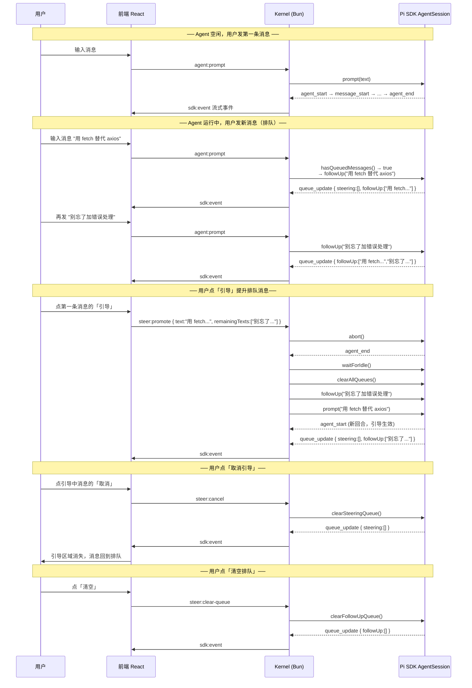
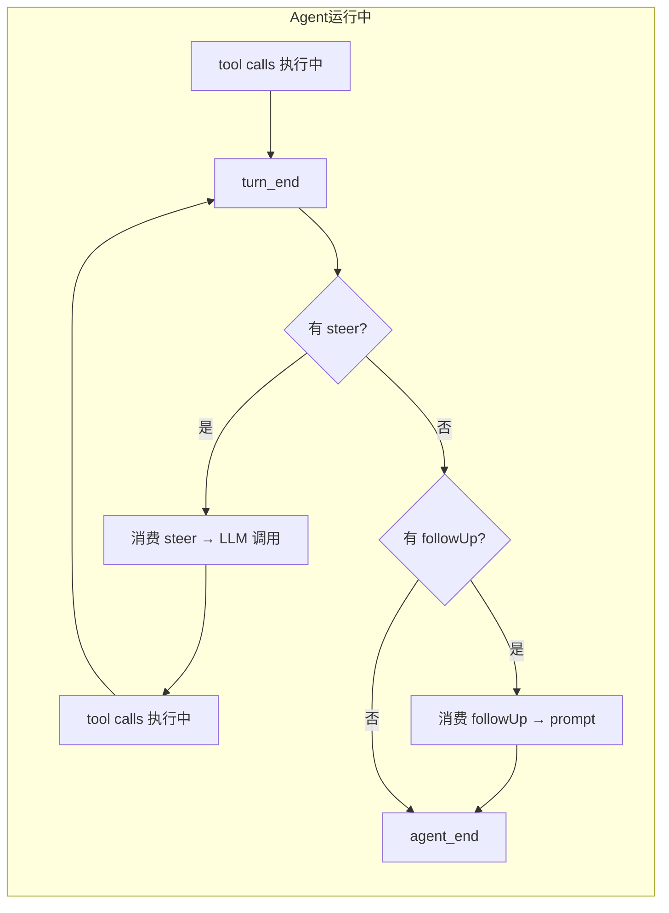

# Steer 消息队列 — 设计文档

- **日期:** 2026-07-08
- **状态:** 审批中

## 1. 背景

用户在 agent 运行中发送消息时，当前实现直接调 `session.prompt(text, {streamingBehavior: "steer"})`，消息排队后用户看不到队列状态、无法取消、无法调整优先级。

需支持：队列状态展示、引导升级、立即执行、取消引导、清空排队。

## 2. 设计决策

**所有消息默认 followUp（排队），不自动 steer。** 用户手动点「引导」才升级为 steer。

## 3. 业务流程图

### 3.1 完整交互序列



### 3.2 消息投递时机



## 4. UI 原型图

顶部状态栏固定显示：执行时间 + [停止] 按钮。

### 状态 A：全部排队（无引导）

```
┌──────────────────────────────────────────────────────────┐
│  🟠 思考中... 12s                              [停止]    │
│                                                          │
│  排队 3 条                                       [清空]   │
│  ┌──────────────────────────────────────────────────┐    │
│  │ · 用 fetch 替代 axios          [引导] [立即]     │    │
│  │ · 别忘了加错误处理              [引导] [立即]     │    │
│  │ · 类型也要改                    [引导] [立即]     │    │
│  └──────────────────────────────────────────────────┘    │
│  💡 引导：下回合立即生效 │ 立即：中断当前并立即执行      │
│  ────────────────────────────────────────────────────    │
│  ┌──────────────────────────────────────────────────┐    │
│  │                                                  │    │
│  │  输入要加入队列的引导...                      ↑  │    │
│  │                                                  │    │
│  └──────────────────────────────────────────────────┘    │
└──────────────────────────────────────────────────────────┘
```

### 状态 B：有一条引导中 + 排队

```
┌──────────────────────────────────────────────────────────┐
│  🟠 思考中... 12s                              [停止]    │
│                                                          │
│  引导中:  "用 fetch 替代 axios"                  [取消]   │
│                                                          │
│  排队 2 条                                       [清空]   │
│  ┌──────────────────────────────────────────────────┐    │
│  │ · 别忘了加错误处理              [引导] [立即]     │    │
│  │ · 类型也要改                    [引导] [立即]     │    │
│  └──────────────────────────────────────────────────┘    │
│  💡 引导：下回合立即生效 │ 立即：中断当前并立即执行      │
│  ────────────────────────────────────────────────────    │
│  ┌──────────────────────────────────────────────────┐    │
│  │                                                  │    │
│  │  输入要加入队列的引导...                      ↑  │    │
│  │                                                  │    │
│  └──────────────────────────────────────────────────┘    │
└──────────────────────────────────────────────────────────┘
```

### 状态 C：发送中（点击引导/立即后的过渡）

```
┌──────────────────────────────────────────────────────────┐
│  ⏳ 发送中...                                            │
│                                                          │
│  发送中:  "用 fetch 替代 axios"                          │
│  ⏳ 正在中断当前任务...                                   │
│                                                          │
│  排队 2 条                                       [清空]   │
│  ┌──────────────────────────────────────────────────┐    │
│  │ · 别忘了加错误处理                     — 置灰     │    │
│  │ · 类型也要改                           — 置灰     │    │
│  └──────────────────────────────────────────────────┘    │
│  ────────────────────────────────────────────────────    │
│  ┌──────────────────────────────────────────────────┐    │
│  │                                                  │    │
│  │  输入要加入队列的引导...                      ↑  │    │
│  │                                                  │    │
│  └──────────────────────────────────────────────────┘    │
└──────────────────────────────────────────────────────────┘
```
> 点击 [引导] 或 [立即] 后立即显示此过渡态。Kernel 执行 abort → waitForIdle → 重入队期间，按钮不可点击。
> 收到下一个 queue_update 或 agent_start 事件后自动切换到状态 B（引导中）或状态 A（排队）。

### 状态 D：空队列（无引导、无排队）

```
┌──────────────────────────────────────────────────────────┐
│  🟠 思考中... 12s                              [停止]    │
│                                                          │
│                     （无排队消息）                         │
│  ────────────────────────────────────────────────────    │
│  ┌──────────────────────────────────────────────────┐    │
│  │                                                  │    │
│  │  输入要加入队列的引导...                      ↑  │    │
│  │                                                  │    │
│  └──────────────────────────────────────────────────┘    │
└──────────────────────────────────────────────────────────┘
```
> agent 空闲时整个区域隐藏。agent 运行中但无排队/引导时显示此态。输入框始终可用。

### 状态机

```
         ┌─── agent idle ────→ 隐藏全部
         │
  状态 D │   [引导]/[立即] 完成
  (空队列)◄────────────────── 状态 C ──→ 状态 B / 状态 A
     │                         (发送中)
     │ 用户发消息                  ↑
     ↓                            │ queue_update / agent_start
  状态 A ◄────────────────────────┘
  (排队中)
     │  [引导]
     ↓
  状态 B ──── [取消] ────→ 状态 A
  (引导中)
```

### 执行时间

- 前端收到 `turn_start` 或 `agent_start` → 启动计时器，每秒刷新 "Xs"
- 收到 `turn_end` 或 `agent_end` → 停止计时
- 仅前端逻辑，不涉及 Kernel 改动

### [停止] 按钮

- 等同 abort：发 `agent:abort` 事件（已有协议，不需新增）
- 位于顶部状态栏右侧，agent 运行中始终可见
- agent idle 后隐藏

### 按钮行为

| 按钮 | 出现位置 | WS 事件 | Kernel 操作 |
|---|---|---|---|
| `[引导]` | 排队消息旁 | `steer:promote` | abort → clearAllQueues → 剩余入 followUp → prompt(text) |
| `[立即]` | 排队消息旁 | `steer:immediate` | abort → clearAllQueues → 剩余入 followUp → prompt(text) |
| `[取消]` | 引导中消息旁 | `steer:cancel` | clearSteeringQueue() |
| `[清空]` | 排队区域 | `steer:clear-queue` | clearFollowUpQueue() |

- agent **idle 后**整个队列区域自动隐藏
- `[引导]` 将消息提升为 steer（tool calls 结束后立刻插入 LLM 调用前）
- `[立即]` abort 当前运行后作为新回合马上开始


## 5. WS 协议

### 5.1 Client → Kernel（新增）

```typescript
// 提升排队消息为引导
{ type: "steer:promote", sessionId: string, text: string, remainingTexts: string[] }

// 立即执行排队消息（abort + 重发）
{ type: "steer:immediate", sessionId: string, text: string, remainingTexts: string[] }

// 取消引导消息
{ type: "steer:cancel", sessionId: string }

// 清空排队队列
{ type: "steer:clear-queue", sessionId: string }
```

### 5.2 Kernel → Client（复用已有）

`queue_update` 事件通过已有 `sdk:event` 信封透传：

```typescript
{ type: "sdk:event", projectId, sessionId, agentName, 
  event: { type: "queue_update", steering: string[], followUp: string[] } }
```

## 6. AgentManager 新增方法

```typescript
// 通过 session.agent.steer() 入队（底层 Agent API）
steerMessage(sessionId: string, text: string): void

// 提升排队消息为引导
async promoteToSteer(sessionId: string, text: string, remainingTexts: string[]): Promise<void>

// 立即执行（abort + 重入队剩余 + prompt）
async immediate(sessionId: string, text: string, remainingTexts: string[]): Promise<void>

// 清空引导队列
clearSteeringQueue(sessionId: string): void

// 清空排队队列
clearFollowUpQueue(sessionId: string): void

// 清空全部
clearAllQueues(sessionId: string): void
```

## 7. shared/types.ts 变更

### SDKEvent 联合类型新增 queue_update

```typescript
| { type: "queue_update"; steering: readonly string[]; followUp: readonly string[] }
```

## 8. ws-server.ts 新增 handler

- `agent:prompt` — 改为判断 `hasQueuedMessages()`，有则 `followUp`，无则 `prompt`
- `steer:promote` → `agentManager.promoteToSteer()`
- `steer:immediate` → `agentManager.immediate()`
- `steer:cancel` → `agentManager.clearSteeringQueue()`
- `steer:clear-queue` → `agentManager.clearFollowUpQueue()`

## 9. 涉及文件

| 文件 | 改动 |
|---|---|
| `packages/kernel/src/agent-manager.ts` | 新增 6 个队列管理方法 |
| `packages/kernel/src/ws-server.ts` | agent:prompt 逻辑调整 + 4 个新 handler |
| `packages/shared/src/types.ts` | 4 个新 WSClientEvent + queue_update SDKEvent |
| `packages/frontend/` | 队列状态 UI 组件（不在本次范围） |
