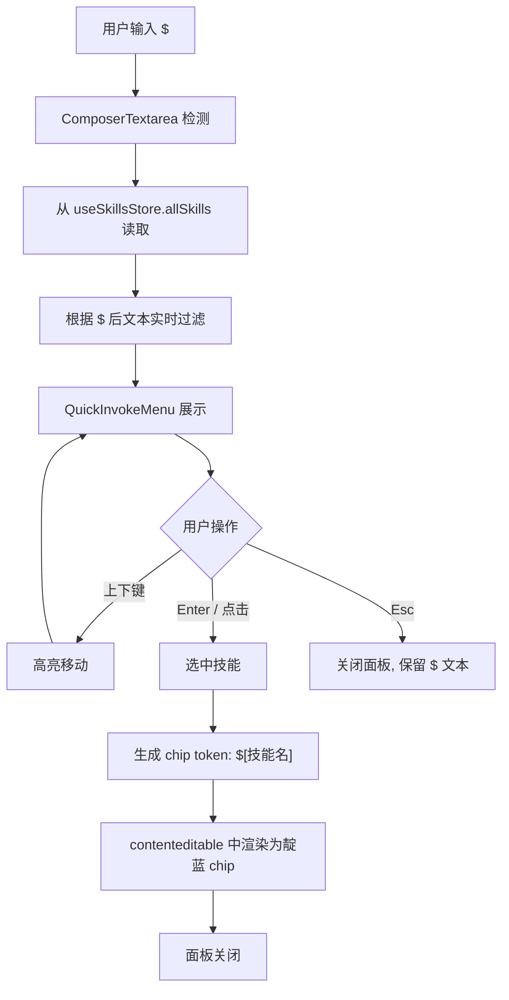
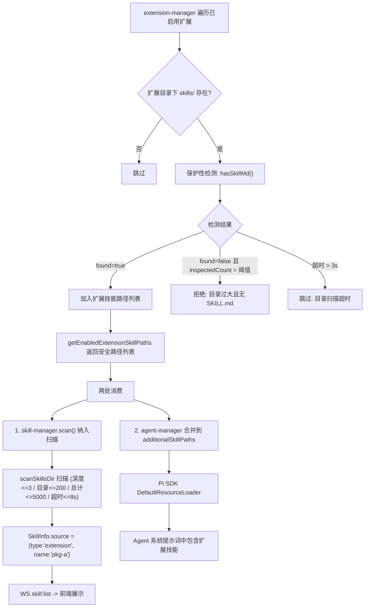

# 聊天栏快速调用（Quick Invoke）

**日期**: 2026-07-15
**状态**: 设计中

## 概述

在 ComposerInput 聊天输入框中，通过 `@` 和 `$` 触发符快速调用项目文件和技能。

- `@` → 弹出文件选择面板，选中的文件以内联 chip 形式插入消息
- `$` → 弹出技能选择面板，选中的技能以内联 chip 形式插入消息

## 业务流程

### 总体流程

```mermaid
flowchart TD
    subgraph 用户交互
        A[用户在输入框输入] --> B{检测触发符}
        B -->|"输入 @"| C[@ 文件选择流程]
        B -->|"输入 $"| D[$ 技能选择流程]
        B -->|普通文本| E[正常输入]
        C --> F[chip 插入输入框]
        D --> F
        F --> G{用户继续操作}
        G -->|继续输入| A
        G -->|按 Enter 发送| H[消息发送流程]
    end

    subgraph 数据加载
        I[前端启动 / 技能变更] --> J[WS: skill:list]
        J --> K[skill-manager.scan]
        K --> L[扫描内置目录]
        K --> M[扫描用户目录]
        K --> N[扫描扩展 skills 目录]
        L --> O[合并 + 去重 + 禁用过滤]
        M --> O
        N --> O
        O --> P[SkillInfo[] -> useSkillsStore]
    end

    subgraph 发送
        H --> Q[contenteditable -> 纯文本]
        Q --> R["chip token 展开: @[相对路径] -> @path"]
        Q --> S["chip token 展开: $[name] -> $name"]
        R --> T[WS: agent:prompt]
        S --> T
        T --> U[Kernel -> Agent 处理]
    end
```

### @ 文件选择流程

```mermaid
flowchart TD
    A[用户输入 @] --> B[ComposerTextarea 检测]
    B --> C{@ 后是否有路径分隔符 /?}
    C -->|有, 如 @packages/| D[调用 fs:listDir 列出目录内容]
    C -->|无, 如 @App| E[调用 fs:searchFilesStream 全文搜索]
    D --> F[QuickInvokeMenu 展示匹配结果]
    E --> F
    F --> G[用户继续输入 -> 实时客户端过滤]
    G --> H{用户操作}
    H -->|"上下键"| I[高亮移动]
    I --> G
    H -->|Enter / 点击| J[选中文件]
    H -->|Esc| K[关闭面板, 保留 @ 文本]
    J --> L["生成 chip token: @[相对路径]"]
    L --> M[contenteditable 中渲染为橙色 chip]
    M --> N[面板关闭]
```

### $ 技能选择流程



### 扩展技能发现流程



### Chip 生命周期

```mermaid
flowdown
    direction LR
    A["输入 @text 或 $text"] --> B["选中后替换为 token"]
    B --> C["contenteditable 内渲染为 chip"]
    C --> D{用户操作}
    D -->|"Backspace (光标在 chip 后)"| E[删除整个 chip]
    D -->|"正常输入"| F[chip 保持不变]
    D -->|"发送消息"| G["token 展开为纯文本"]
    E --> H["token 从文本中移除"]
    G --> I["@[相对路径] -> @path  /  $[name] -> $name"]
```

## 触发与匹配

在 textarea 中检测光标前的文本模式：

- `@文件` 正则：`/(?:^|\s)@([^\s]*)$/`
- `$技能` 正则：`/(?:^|\s)\$([^\s]*)$/`

行为规则：
- `@` / `$` 后的文本作为实时过滤关键词
- 删除触发符后面板消失
- `@` 和 `$` 互斥，同时只开一个面板
- 已存在的 chip 不触发面板

## 弹出面板

- **位置**：固定在 ComposerInput 卡片外部上方，居中对齐
- **宽度**：~400px
- **高度**：自适应，最大 ~300px，超出虚拟滚动
- **外观**：白底卡片，圆角 12px，细边框 + 微阴影，沿用 DESIGN.md 设计语言

### $ 技能面板 — 扁平列表

单一列表，数据来源为文件系统扫描的技能（内置 + 用户目录 + 扩展包 skills/ 目录）。

每项展示：图标 + 技能名 + 描述 + 来源标签（内置/项目/扩展）

### @ 文件面板 — 扁平列表

每项展示：文件图标 + 文件名 + 相对路径

数据来源：复用 `fs-client.ts` 的 `searchFilesStream`（已有）

## 键盘交互

- 上下键导航高亮
- Enter 选中当前高亮项
- Esc 关闭面板，保留已输入的 `@`/`$` 文本
- 鼠标 hover 高亮跟随，点击也可选中
- 继续输入文字实时过滤

## Chip 渲染

输入框从原生 `<textarea>` 改为 **contenteditable div**，支持内联彩色 chip：

- `@文件` chip：橙色 `#EB933E` 背景
- `$技能` chip：靛蓝 `#5B5BD6`（accent）背景

Chip 行为：
- 作为一个不可分割的整体
- Backspace 在 chip 后面时删除整个 chip
- 光标可在 chip 前后自由移动
- chip 以特殊文本 token 存储（如 `@[相对路径]` 和 `$[brainstorming]`）

## 发送给 Agent

chip 在发送时展开为纯文本引用标记，直接拼接在消息文本中：

- `@[相对路径]` -> 消息中保留 `@packages/App.tsx`
- `$[brainstorming]` -> 消息中保留 `$brainstorming`

Agent（kernel 层）看到这些标记后自行处理文件读取和技能加载。前端不做额外 context 注入。

## 扩展技能的发现

### 背景

- Pi SDK 的 `DefaultResourceLoader` 已通过 `additionalSkillPaths` 支持额外技能目录
- WaPi 自实现的 `skill-manager.ts` 有保护性检测（深度/条目/超时限制），但 `hasSkillMd()` 和 `scanSkillsDir()` 是模块级私有函数，需先 export
- 扩展包安装位置：`~/.wa-pi/runtime/node_modules/<package-name>/`（`RUNTIME_DIR` 常量在 `extension-manager.ts:92`）

### 步骤 1：提取私有函数

`skill-manager.ts` 中的 `hasSkillMd()` 和 `scanSkillsDir()` 改为 `export`，或提取到 `packages/kernel/src/skill-utils.ts` 共享模块。供 `extension-manager` 和 `skill-manager` 两方调用。

### 步骤 2：路径来源决策

`extension-manager` 需要访问扩展包的 `skills/` 目录。路径拼接方案：

| 方案 | 描述 | 评估 |
|------|------|------|
| **A. 重拼路径（选用）** | `join(WA_PI_DIR, "runtime", "node_modules", pkgName, "skills")`，WA_PI_DIR 已从 `@wa-pi/shared` 导出 | 最简单，和 `RUNTIME_DIR` 常量语义一致；扩展包安装位置约定明确 |
| B. NpmPackageService 暴露方法 | 新增 `getRuntimeDir()` / `getSkillPath(pkgName)` | 封装好但 NpmPackageService 职责不在此，引入不必要的耦合 |
| C. ExtensionManager 持有 runtimeDir | 构造函数参数，绕过 NpmPackageService | 多一处独立路径拼装点，增加不一致风险 |

选用方案 A：直接用 `WA_PI_DIR` + 固定路径段拼接，不引入新依赖。

### 步骤 3：extension-manager 新增方法

```ts
// extension-manager.ts 新增
import { join } from "node:path";
import { WA_PI_DIR } from "@wa-pi/shared";
import { hasSkillMd } from "./skill-utils";  // 从 skill-manager.ts 提取出的共享函数

async getEnabledExtensionSkillPaths(): Promise<string[]> {
  const { packages } = await this.list();
  const enabled = packages.filter(p => p.enabled);
  const result: string[] = [];
  for (const pkg of enabled) {
    const skillsDir = join(WA_PI_DIR, "runtime", "node_modules", pkg.name, "skills");
    try {
      const { found } = await hasSkillMd(skillsDir);
      if (found) result.push(skillsDir);
    } catch {
      // 目录不存在或无法访问 -> 跳过
    }
  }
  return result;
}
```

### 步骤 4：两处消费

1. **前端展示**：`skill-manager.scan()` 调用时，将 `getEnabledExtensionSkillPaths()` 返回值作为额外扫描目录，`scanSkillsDir()` 已有保护性检测自然覆盖
2. **Agent 使用**：`agent-manager._createSession()` 构造 `DefaultResourceLoader` 时，扩展技能路径合并入 `additionalSkillPaths`

### 步骤 5：前端展示

`SkillInfo` 新增可选字段：

```ts
source?: { type: "builtin" | "project" | "user" | "extension"; name?: string }
```

`$` 面板通过此字段在技能名旁显示来源标签（内置/项目/扩展名）。扩展技能同样受 `disabledSkills` 禁用过滤影响。

### 保护性检测规则

`hasSkillMd()` 和 `scanSkillsDir()` 需先从 `skill-manager.ts` **export**（或提取到 `skill-utils.ts` 共享模块），供 `extension-manager` 入口过滤 + `skill-manager` 正式扫描两处调用。

| 检测项 | 函数 | 限制 | 失败处理 |
|--------|------|------|---------|
| skills/ 目录存在性 | — | — | 跳过该扩展 |
| 快速验证含 SKILL.md | `hasSkillMd()` | 深度 ≤ 3，条目 ≤ 1000 | 未找到 + 遍历 > 30 条则拒绝 |
| 验证超时 | `hasSkillMd()` | 3 秒 | 跳过，记录日志 |
| 正式扫描 | `scanSkillsDir()` | 深度 ≤ 3 / 目录 ≤ 200 / 总计 ≤ 5000 / 超时 ≤ 8s | 跳过该目录 |

`getEnabledExtensionSkillPaths()` 在入口处调用 `hasSkillMd()` 做快速过滤，只返回通过检测的路径。

## 组件结构

```
ComposerInput.tsx          <- 改造：触发检测 + 面板状态 + chip 管理
├── QuickInvokeMenu.tsx    <- 新增：统一弹出面板
│   ├── FileItem           <- @ 文件列表项
│   └── SkillItem          <- $ 技能列表项（含来源标签）
└── ComposerTextarea.tsx   <- 新增：contenteditable div，chip 内联渲染 + 光标管理
```

## 测试策略

| 层 | 内容 |
|---|------|
| 单元测试 | `activeFileReferenceToken` 正则匹配、chip token 序列化/反序列化、过滤逻辑 |
| 组件测试 | ComposerTextarea chip 渲染、QuickInvokeMenu 列表渲染、键盘导航 |
| 集成测试 | `skill:list` WS 协议返回扩展技能、扩展技能扫描逻辑、`getEnabledExtensionSkillPaths` 路径拼接 |
| E2E | 输入 @ 选文件 -> chip 显示 -> 发送；输入 $ 选技能 -> chip 显示 -> 发送 |

## 不在此次范围

- 扩展包 `package.json` 中 `pi.skills` 字段声明技能（后续补）
- `@` 文件引用发送时附带文件内容作为 context（当前仅传文本标记）
- MCP 工具在 `$` 面板中的展示
