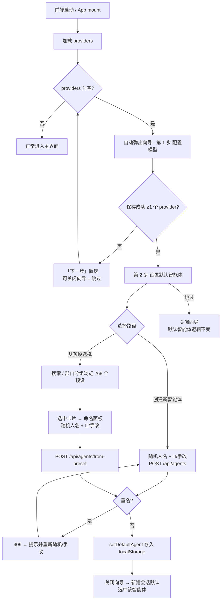
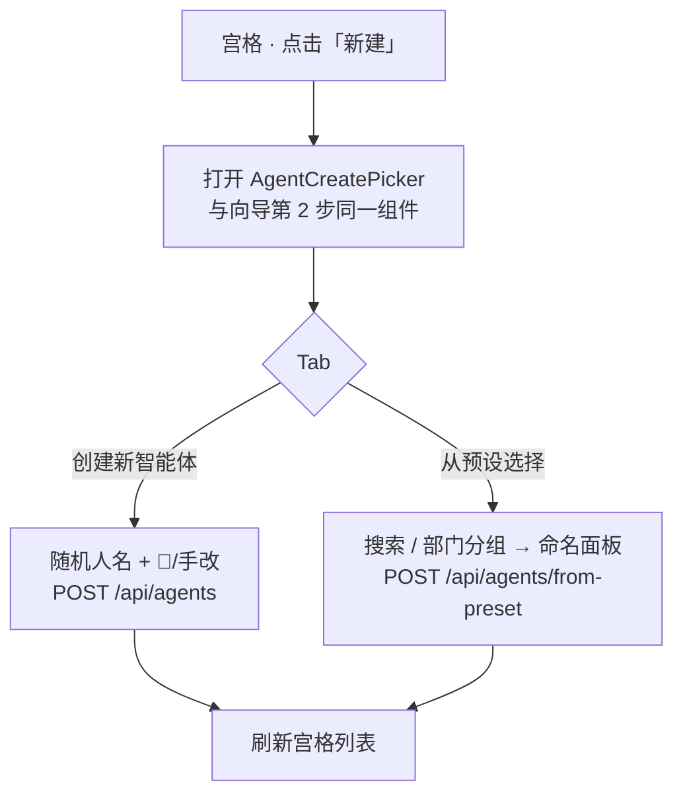
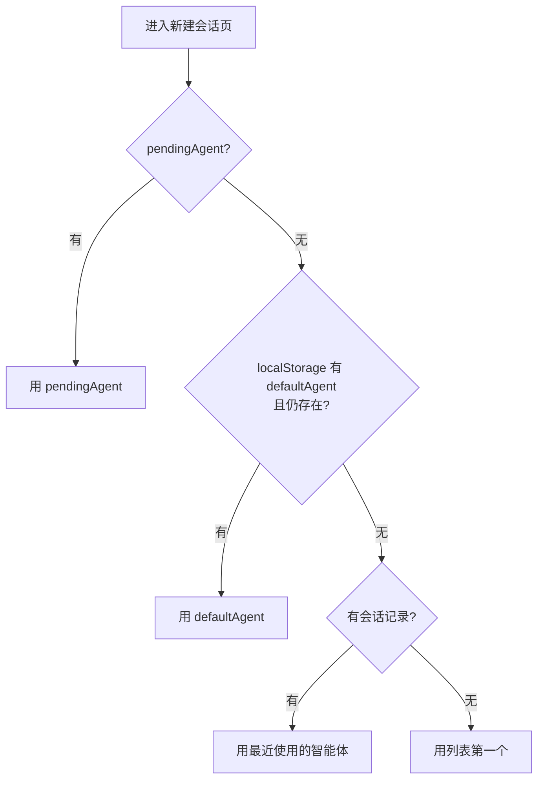
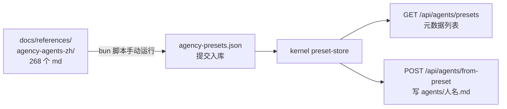

# 初始化向导（Onboarding Wizard）设计文档

- 日期：2026-08-07
- 状态：已确认

## 背景与目标

当前首次启动体验：kernel 自动 seed 9 个内置智能体，providers 为空，用户需自己摸进「设置 → 模型管理」添加模型供应商。未配置 provider 时消息发不出去，是唯一硬性阻塞点。

目标：新增初始化向导，首次启动（无模型时）自动引导用户完成两件事：

1. **配置模型** — 填写模型供应商（复用现有表单逻辑：预设快捷选择 / API Key / Base URL / 模型列表 / 连接测试）
2. **设置默认智能体** — 创建新智能体（随机人名，可改），或从 268 个预设智能体中选择并保存为自己的智能体（随机人名，可改）；选中的智能体成为后续新建会话的默认智能体

预设智能体库来自 `docs/references/agency-agents-zh/`（268 个，19 个部门，每个 md 文件含 YAML frontmatter：`name`/`description`/`emoji`/`color` + 正文人格提示词）。

## 关键决策（已与用户确认）

- 触发时机：**无模型（providers 为空）时自动弹出** + 设置弹窗提供「重新打开引导」入口
- 步骤流程：**2 步**（模型 → 智能体）；第 1 步不可跳过（未保存成功 provider 前「下一步」置灰），第 2 步可跳过
- 智能体步骤操作：创建新智能体 或 从预设选择；选定后成为**默认智能体**
- 预设展示：**搜索 + 部门分组浏览**
- 预设选择器使用范围：**向导 + 宫格新建流程共用同一组件**；宫格原「输入名字创建」流程被新面板取代
- 命名方式：每个智能体有**人名**（如「林晓岚」）——选中预设或创建空白时**随机生成中文人名，🎲 可换，可手改**
- 默认智能体持久化：前端 localStorage（zustand persist，沿用 composer-prefs 模式），kernel 不存
- 预设数据管线：构建期脚本生成 JSON + kernel 新增独立预设 API
- 现有 9 个内置 seed 智能体**保持不变**，不改名、不动已有数据

## 业务流程图

### 流程一：首次启动初始化向导



### 流程二：智能体宫格「新建」（修改后）



注：宫格场景**不设置默认智能体**，仅创建；设置默认是向导专属动作。

### 流程三：新建会话默认智能体决策（pickDefaultAgent）



### 流程四：预设数据管线（构建期）



## 业务修改点

对**现有业务行为**的修改，逐条列出（修改前 → 修改后）：

| # | 位置 | 修改前 | 修改后 |
|---|------|--------|--------|
| 1 | `App.tsx` 启动 | 无 onboarding 逻辑，providers 为空时用户自行摸索 | providers 为空自动弹出向导；关闭后下次启动仍为空则再弹 |
| 2 | `AgentGalleryModal` 新建 | 点击「新建」→ 只填名字创建 | 点击「新建」→ 打开 AgentCreatePicker 两 Tab 面板（空白创建带随机人名 / 从预设选择） |
| 3 | `NewSessionPane.pickDefaultAgent` | 优先级：pendingAgent → 最近使用 → 列表第一 | 优先级：pendingAgent → **defaultAgent（新增）** → 最近使用 → 列表第一 |
| 4 | 设置弹窗 general 页 | 无入口 | 新增「重新打开引导」入口 |
| 5 | `ProviderFormModal` | 表单与弹窗耦合 | 抽出 `ProviderForm` 共用组件（**纯结构重构，行为不变**） |
| 6 | kernel 路由表 | 无预设 API | 新增 `GET /api/agents/presets`、`POST /api/agents/from-preset`（纯新增，不改既有端点） |
| 7 | 新建的智能体文件 | seed/手工创建，正文无名字 | 从预设创建的正文开头注入「你的名字是『X』」 |

**明确不变的部分**（兼容性检查）：

- 9 个内置 seed 智能体：不改名、不删除、seed 幂等逻辑不动
- 既有 `POST /api/agents`（只收 displayName）、`PUT /api/agents/:name/config` 等端点签名与行为不变
- providers 相关 API 与 `ProviderFormModal` 在设置页的表现不变
- 已存量的用户智能体 md 文件不做任何迁移

## 架构

数据流向：

```
docs/references/agency-agents-zh/**/*.md
  → scripts/generate-agency-presets.ts（构建期手动运行）
  → packages/kernel/src/data/agency-presets.json（提交入库）
  → kernel preset-store + routes/agent-presets.ts
  → GET /api/agents/presets（元数据列表，约 80KB，不含正文）
  → POST /api/agents/from-preset { id, displayName }（创建 agent md）
  → 前端 AgentCreatePicker（向导第 2 步 + 宫格新建共用）
```

kernel 改动限于新增独立文件，不碰现有 seed / 路由逻辑。

## kernel 侧（新增）

### `scripts/generate-agency-presets.ts`
- 扫描 `docs/references/agency-agents-zh/` 下部门目录中的 268 个智能体 md；排除顶层索引文档（AGENT-LIST/CATALOG/README 等）、assets/scripts/examples 目录，以及不含合法 frontmatter 的 md（如 integrations/strategy 等非部门目录自然落空）
- 解析 YAML frontmatter（name/description/emoji/color）+ 正文 + 目录名映射的部门中文名
- 输出 `packages/kernel/src/data/agency-presets.json`：`[{ id, name, description, emoji, color, department, body }]`
- `id` 用文件名去 `.md` 后缀（如 `engineering-frontend-developer`）

### `packages/kernel/src/preset-store.ts`
- 加载 agency-presets.json
- `list()`：返回元数据（剔除 body）
- `get(id)`：返回完整预设（含 body）

### `packages/kernel/src/routes/agent-presets.ts`
- `GET /api/agents/presets` → `AgencyPresetMeta[]`
- `POST /api/agents/from-preset`，body `{ id, displayName }`：
  - id 不存在 → 404
  - displayName 与现有智能体重名 → 409
  - 成功：写 `~/.pi/agent/agents/<displayName>.md`，frontmatter 含 `description`（预设 description）、`avatar`（预设 emoji）；正文开头注入 `你的名字是「<displayName>」。`，其余为预设 body
  - 返回创建的 `AgentConfig`
- 在 `kernel/src/index.ts` 注册路由（一行）

### `packages/shared`
- 新增 `AgencyPreset` / `AgencyPresetMeta` 类型
- 新增目录名 → 中文部门名映射（19 个部门）

## 前端侧

### 新增

- `src/data/name-pool.ts`：中文姓氏（约 50）+ 名字（约 100），`randomPersonName()` 随机组合；提供与现有智能体列表查重的重试逻辑
- `src/store/onboarding.ts`（zustand + persist，沿用 composer-prefs 的 localStorage 模式）：
  - `defaultAgent: string | null` + `setDefaultAgent()`
  - `wizardOpen: boolean` + open/close（不持久化，仅会话内）
- `src/components/onboarding/OnboardingWizard.tsx`：
  - Modal（沿用 createPortal + 自定义 Modal 惯例）+ 两步步骤条
  - 第 1 步：嵌入抽出的 `ProviderForm`，保存成功 ≥1 个 provider 后「下一步」才可点
  - 第 2 步：内嵌 `AgentCreatePicker`；「完成」「跳过」「上一步」
  - 中途关闭 = 跳过；providers 仍为空则下次启动再弹
- `src/components/onboarding/AgentCreatePicker.tsx`（向导第 2 步 + 宫格新建共用）：
  - 两个 Tab：「✚ 创建新智能体」/「📚 从预设选择」
  - 创建新智能体：名字输入框（自动填入随机人名 + 🎲 换名），走现有 `POST /api/agents`
  - 从预设选择：搜索框（按名字/描述过滤）+ 按 19 个部门分组的卡片（emoji + 中文名 + 描述）
  - 选中预设卡片 → 命名面板：大 emoji + 角色名 + 随机人名（🎲 / 手改）+ 角色能力描述 + 「保存为我的智能体」→ `POST /api/agents/from-preset`
  - 创建/保存成功后回调 `onCreated(displayName)`：向导场景设默认智能体并关闭向导；宫格场景刷新列表
  - 手改人名与现有智能体重名：保存按钮置灰 + 提示（kernel 409 双保险）

### 修改

- `ProviderFormModal.tsx`：抽出表单主体为 `ProviderForm` 组件，设置页与向导第 1 步共用（样式/行为不变）
- `App.tsx`：mount 加载 providers 后，若 `providers.length === 0` 自动打开向导；渲染 `OnboardingWizard`（与 SettingsModal 同层）
- 设置弹窗 general 页：加「重新打开引导」入口
- `AgentGalleryModal.tsx`：「新建」按钮点击后打开 `AgentCreatePicker`（取代原只填名字的流程）
- `NewSessionPane.pickDefaultAgent` 优先级改为：`pendingAgent → defaultAgent（onboarding store）→ 最近使用 → 列表第一`

## 数据流（保存预设智能体）

1. 前端 `GET /api/agents/presets` 渲染搜索/分组列表
2. 用户选中卡片 → 命名面板随机生成人名（查重，重名自动重随机）
3. 点击保存 → `POST /api/agents/from-preset { id, displayName: "林晓岚" }`
4. kernel 写 agent md → 前端刷新 agents store
5. 向导场景：`setDefaultAgent("林晓岚")`，关闭向导
6. 之后新建会话：`pickDefaultAgent` 优先返回 defaultAgent

## 错误处理

| 场景 | 处理 |
|------|------|
| displayName 重名 | 前端置灰提示 + kernel 409 |
| 预设 id 不存在 | kernel 404，前端 Toast 提示 |
| 模型步未保存任何 provider | 「下一步」置灰 |
| 向导中途 Esc / 关闭 | 视为跳过；providers 仍为空则下次启动再弹 |
| 预设角色与 9 个内置智能体同角色名 | 无冲突（保存用人名，文件名不撞） |
| agency-presets.json 缺失/损坏 | kernel 启动不崩溃，presets 返回空列表 |

## 测试（四层，按 AGENTS.md 验收标准）

1. **单元测试（bun:test）**
   - 生成脚本：fixture md → 解析字段正确、排除索引文档
   - preset-store：list 不含 body、get 未知 id
   - 预设路由：200 / 404 / 409，创建出的 md frontmatter 与正文注入正确
   - name-pool：查重重试
   - pickDefaultAgent：四级优先级
2. **组件测试（Vitest + testing-library + happy-dom）**
   - OnboardingWizard：步骤流转、第 1 步闸门
   - AgentCreatePicker：搜索过滤、部门分组、命名面板（随机名 / 🎲 / 手改 / 重名置灰）
3. **API 集成测试（curl）**
   - `GET /api/agents/presets` 成功
   - `POST /api/agents/from-preset` 成功 + 409 重名 + 404 未知 id
4. **E2E（Playwright）**
   - API 清空 providers → 打开页面自动弹出向导 → 配置模型 → 第 2 步选预设、改名、保存 → 断言宫格出现新智能体、新建会话默认选中 TA → finally 清理测试数据
   - 截图等测试产物全部删除

## 变更日志

实现完成后按 AGENTS.md 第 7 节在根目录 `CHANGELOG.md` 顶部追加一条记录（类型：新增功能；影响范围：kernel 预设 API、前端向导与宫格新建流程）。
